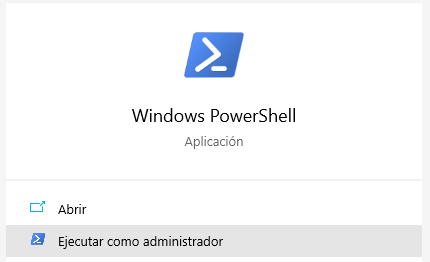

# Instructivo de acceso al proyecto
En está página se encuentran las instrucciones para trabajar con el proyecto **Paradox**.

## Instalación de librerías
### JDK
Debemos tener instalado JDK 8 (o mayor). Para verificar si lo tenemos instalado, ejecutamos `java -version` en el símbolo del sistema (cmd); el sistema debería devolver `java version "1.8._"` (entre otros datos).
Si no lo tenemos instalado, o poseemos una versión menor, debemos instalarlo desde este [link](https://www.oracle.com/java/technologies/javase/javase-jdk8-downloads.html) (*link de sugerencia*) y buscar el archivo correspondiente a nuestro sistema operativo.

### SBT
Una vez tengamos instalado JDK, procederemos a instalar SBT desde el [link oficial](https://www.scala-sbt.org/download.html?_ga=2.243907525.1375124500.1618238697-1553662989.1615385414), donde escogeremos el archivo acorde a nuestro sistema operativo.
Podemos verificar la instalación ejecutando `sbt -version` desde el símbolo del sistema.

## Clonar el proyecto con GIT
### Instalación de GIT Bash
Vamos a necesitar instalar GIT Bash para este proyecto, si ya está instalado, se puede saltar al siguiente paso.
Primero, accedemos al [link de descarga](https://git-scm.com/downloads), de aquí bajaremos el archivo correspondiente a nuestro sistema operativo.

Una vez ejecutemos el archivo (y demos el permiso de administrador), veremos esta pantalla (v. 2.31.1):

Clic en **Next**.

Seleccionamos los componentes:

Clic en **Next**.

Escogemos nuestro editor de código deseado:

Clic en **Next**.

Marcamos la primera opción:

Clic en **Next**.

Opción "Git from the command line and also from 3rd-party software"

Clic en **Next**.

Clic en **Next**:


Clic en **Next**:


Nos aseguramos que esté seleccionado "MinTTY":

Clic en **Next**.

Opción "Default":

Clic en **Next**.

Clic en **Next**:


Seleccionamos "Enable file system caching" y "Enable symbolic links":

Clic en **Next**, y luego clic en **Install**.

Cuando termine la instalación aparecerá esta pestaña:

Deseleccionamos "View Release Notes" y seleccionamos "Launch Git Bash".

Cuando se abra la ventana de comandos, escribimos `git --version` para verificar que todo salió bien. La consola debería retornar la versión de **git** instalada.

Podemos salir de la consola escribiendo `exit` (y presionando "Enter").

### Clonar el proyecto de GitLab
Para clonar el proyecto de GitLab, podemos ir al [link del proyecto](https://gitlab.com/enterprisesolutionspy/paradox) (debemos tener una cuenta de GitLab para ver el link). Una vez allí (y una vez se nos haya autorizado al proyecto), hacemos clic en **Clone**:


De aquí copiaremos la URL.
Debemos tener abierta la consola de Git Bash. Primero debemos abrir la carpeta donde queremos clonar el proyecto, para esto escribimos `cd (Directorio)` (ej: cd Desktop/Proyecto).

*Recomendamos que no haya ningún espacio en los nombres de las carpetas, así evitamos que los programas se confundan y produzcan un error.*

Luego, escribimos (en la consola de git) `git clone ` seguido del link que copiamos anteriormente (`git clone https://gitlab.com/enterprisesolutionspy/paradox.git`)

Para chequear el estado del proyecto respecto a nuestra máquina, podemos escribir `git status`.
Si se requieren más instrucciones de manejo del **git**, se puede visitar este [link](https://docs.gitlab.com/ee/gitlab-basics/start-using-git.html).

## Crear documentación
Para este proyecto de documentación, usamos los archivos **MarkDown**, reconocibles por su extensión `.md`. El archivo principal (Pantalla de Inicio) se encontraría en `src/main/paradox`, bajo el nombre de `index.md`.
Las imágenes son guardadas en una carpeta con nombre `img`. A cada interfaz HTML corresponde un archivo MarkDown. Para cada sección hay una carpeta, donde suele haber un `index.md`, una carpeta de imágenes, y unos cuantos archivos de MarkDown.

### Tabla de contenido
Para organizar la jerarquía y el índice de los archivos, se establecen las divisiones de cada archivo en la sección `@@@index`:

```
@@@ index


@@@
```
El código anterior indica que la página tendría dos páginas hijas: **Pagina1** (Así aparecería en la tabla de contenido), que se encuentra ubicada en la misma carpeta; y **Pagina2**, que se encuentra en la carpeta paginas, bajo el nombre de `pagina2.md`.

La tabla de contenido se crea automáticamente a partir de esto, lo que va en cada viñeta es definido por el texto entre corchetes: `[]`.

Las páginas "hijas" pueden tener más páginas hijas, la tabla de contenido las organiza automáticamente de manera jerárquica.

Se puede definir la **profundidad** de la tabla de contenidos: profundidad **1** significa que se muestran solo los títulos principales (páginas raíz); profundidad **2** indica que se ven las páginas principales y sus hijas, pero no se ven las hijas de las hijas; profundidad **3** indica que se ven las páginas padre, las hijas, y las hijas de las hijas. Y así sucesivamente.

La línea a continuación establece una profundidad (depth) de 2:

`@@toc { depth=2 }`

Para cambiar la profundidad solo se requiere cambiar el número correspondiente a **depth**.

### Títulos
El primer título de una página siempre será el título de la página, aunque sea más pequeño que los demás.

Para definir títulos en MarkDown, se usa "`#`":

```
# Título más grande
## Título no tan grande
###### Título más pequeño
```


Los títulos sirven para organizar la página y definir la tabla de contenidos.

### Formatos de texto
El texto normal no requiere de ningún añadido.

El texto en **negrilla** requiere tener '`**`' a ambos lados: `**negrilla**`, sin nigún espacio.

El texto en _cursiva_ puede hacerse con '`*`' o '`_`' a ambos lados: `*cursiva*` o `_cursiva_`.

Los formatos anteriores pueden ser combinados: `***abc*** y **a*b*c**` = ***abc*** y **a*b*c**.

El texto ~~tachado~~ se hace con '`~~`' a ambos lados: `~~tachado~~`.

Se pueden hacer citas poniendo `>` al inicio del texto:
> Ejemplo

`> Ejemplo`

Para que no sea incluido el texto normal en la cita, solamente deje una línea vacía entre el texto de la cita y el texto normal:

```
> Cita

Texto normal

> Cita
Texto de cita

Texto normal
```

Lo anterior se vería así:


También se puede citar código, es decir, hacer que las letras tengan un `aspecto de código`, poniéndoles ` en ambos lados.

Para citar varias líneas de código, usamos ```, que se separa del texto con una línea (Enter) al inicio y al final, es decir, el símbolo ocupa una línea entera, sin compartir:

```
Varias
líneas
de
código
```
Sería el resultado de:


### Listas
Se pueden hacer listas usando '*' o '-' como viñeta, seguido de un espacio:
* Item 1
* Item 2

- Item 3
- Item 4

Lo anterior se ve así en el código:


Para hacer listas ordenadas, simplemente se pone un número y un punto como viñeta:
1. Lista
2. Ordenada

Código:


Se pueden anidar listas:
1. Elemento padre.
   * Element hijo.
   * Elemento hijo 2.
     * Elemento nieto.

Para hacer esto, se alinea la primera letra del elemento padre con la viñeta del elemento hijo:


### Links
Se pueden incluir [links]() en las palabras, usando corchetes `[]` para el texto, y poniendo un `()` al lado (para el link), de la forma `[Texto](http://www.ejemplo.com)`:


**Resultado:**

Este link conduce a [Google](https://www.google.com)

*Nótese que debe incluirse el "http" de la URL.*

### Imágenes
Para incluir una imagen, se tiene la sintaxis ``:

El código:


Se vería:


## Exportar documentación con Scala Building Tool (SBT)
Una vez tengamos listos los archivos MarkDown (`.md`) podemos exportarlos a formato Web (`.html`) o Pdf para su visualización.
### Formato Web (HTML)
Debemos abrir una consola de comandos (Puede usar el Símbolo del sistema) y escribir `sbt`. Esperamos un rato, hasta que se inicie el shell de SBT:


Si ya hicimos una exportación y queremos borrar los archivos generados previamente, podemos escribir `clean` en la consola. Esto no es necesario hacerlo cada vez.

Compilamos los archivos escribiendo `compile` en la consola. Una vez termine (recordemos que hay que esperar hasta que el sbt retorne `sbt:paradox>`), podemos proceder a ejecutar, escribimos `paradox` en el shell (y presionamos enter). Esto debería generar los archivos `.html` correspondientes.

Para acceder al `index.html`, ingrese a `target/paradox/site`.

*Si desea que los cambios se actualicen automáticamente, puede ejecutar* `~paradox` *en vez de* `paradox`*, así cada vez que modifique (y guarde) los archivos MarkDown, el HTML también se modificará*

### Formato Pdf
#### Instalaciones requeridas
##### WSL2
*Este paso es necesario si su computadora usa Windows; si no usa Windows, continúe a la sección **Docker**.*

Primero, ejecutamos un PowerShell en modo administrador, podemos hacer esto buscando el programa en la barra de búsqueda de Windows, luego haciendo clic sobre el botón **Ejecutar como administrador**:



Luego ejecutamos el comando `Enable-WindowsOptionalFeature -Online -FeatureName $("VirtualMachinePlatform", "Microsoft-Windows-Subsystem-Linux")`:


Después de ejecutarlo:


Al terminar:


Se pide reiniciar el equipo: si es posible, cierre sus aplicaciones y reinícielo; si no, reinícielo más tarde.

Una vez hecho esto, descargue el ["Linux kernel update package"](https://wslstorestorage.blob.core.windows.net/wslblob/wsl_update_x64.msi) (la descarga se iniciará apenas haga clic en el link).
Ejecute el archivo y realice la instalación.

Por último, abra PowerShell y ejecute el comando "`wsl --set-default-version 2`". Luego reinicie de nuevo el computador.

##### Docker

Se necesita también instalar Docker (El paso anterior es requisito para que Docker funcione en Windows), puede descargarse desde la [página](https://www.docker.com/products/docker-desktop).

Una vez lo instale, asegúrese que esté funcionando antes de continuar al paso siguiente:


*La instalación y ejecución de Docker pueden tomar bastante tiempo.*

#### Exportación
Para la generación del PDF, se ejecuta el comando `paradoxPdf` en el shell de sbt.
El PDF se creará en `target/paradox/pdf`.