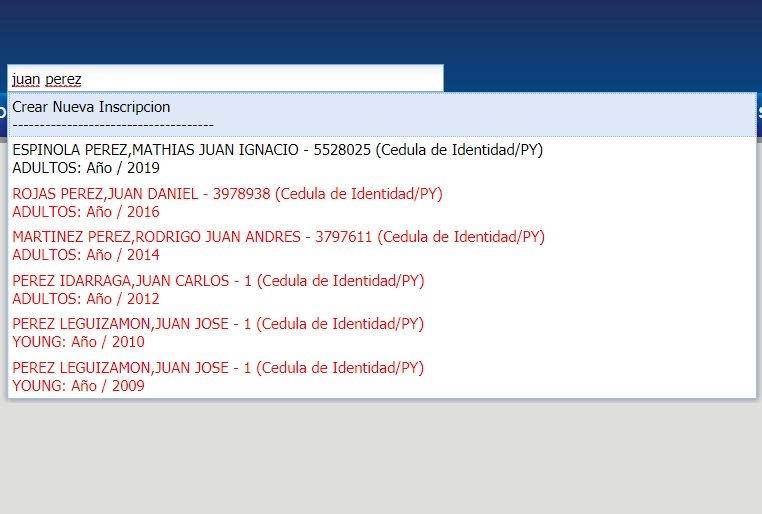

# Alumno

@@toc { depth=1 }
@@@ index
* [Inscripcción](./inscripcion.md)
* [Inscripcción Crear](./inscripcionCrear.md)
* [Inscripcción Editar](./inscripcionesEditar.md)
* [Cursos](./cursos.md)
* [Examenes](./examenes.md)
* [Examenes Especiales](./examenesEspeciales.md)
* [Notas](./notas.md)
* [Situacion Academica](./situacionAcademica.md)
* [Situacion Administrativa](./situacionAdministrativa.md)
* [Manejar Pendientes](./manejarPendientes.md)
@@@

## Buscador de alumno

Sirve para realizar la búsqueda de Alumnos en el sistema académico.

Puede introducir el nombre, documento o código del alumno para realizar la búsqueda.

_Observación: el buscador puede mostrar valores de las siguientes maneras:_

* Texto en color negro: son valores actuales.
* Texto en color rojo: son valores pasados.
