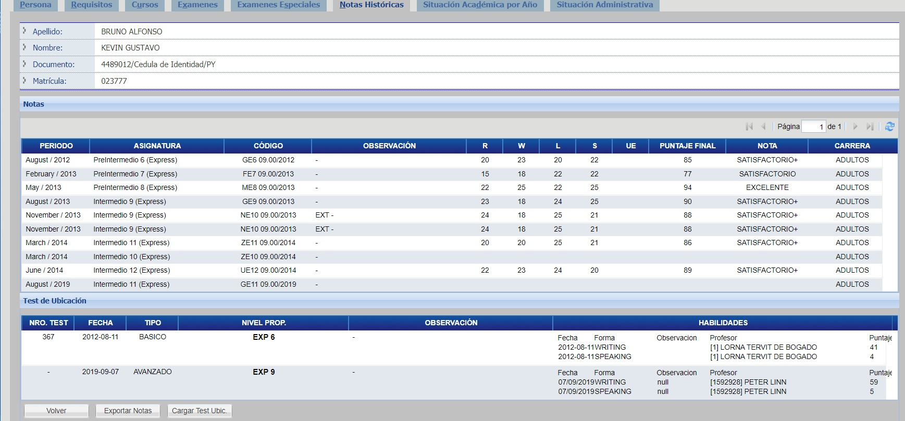
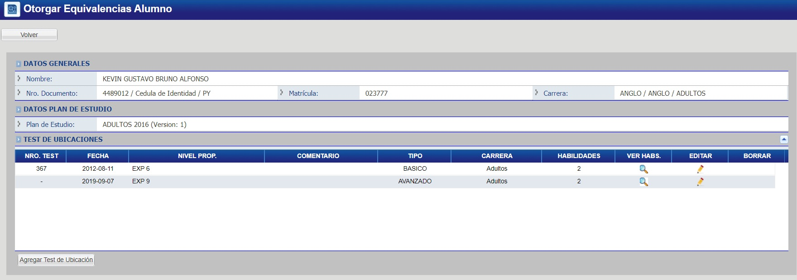
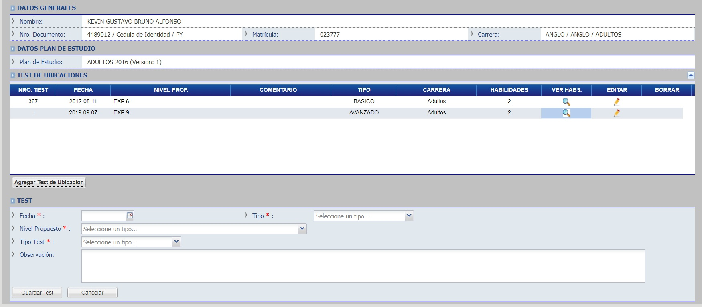
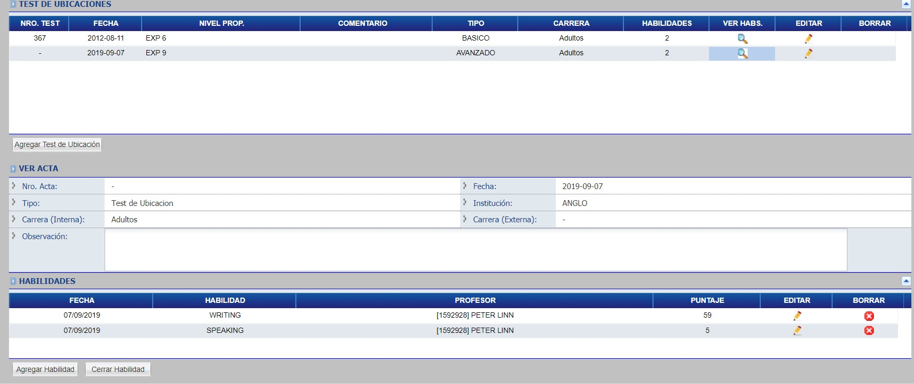

# Notas
 
## Ver Calificaciones

Para ver las calificaciones de un alumno, acceda a la pestaña _"Notas"._

## Exportar Ficha Alumno 

Para exportar notas, haga click en el botón "Exportar Notas", ubicado en la parte inferior de la pantalla.
Seguidamente, elija el formato al cuál desea exportar y listo.

## Listar Test de Ubicacion

Haga click en el botón "Cargar Test Ubic." ubicado en la parte inferior de la pantalla:

Lo cual lo llevará a la lista de _Test de Ubicación_ de un alumno.

## Agregar Test de Ubicacion

Para agregar un _Test de Ubicación_ haga click en el botón "Agregar Test de Ubicación", el cual le mostrará los campos a ser completados para crear el mismo.

Una vez completado, haga click en "Guardar Test" y listo.

## Editar Test de Ubicacion

Para editar un _Test de Ubicación_ haga click en el botón con ícono de _lápiz._ 

Le mostrará el siguiente formulario con los datos del _Test de Ubicación_ seleccionado, modifique los datos y haga click en el botón "Guardar Test".

## Agregar habilidad

Haga click en el botón con ícono de lupa, correspondiente al _Test de Ubicación_ que desea agregar la habilidad. Seguidamente haga click en el botón "Agregar Habilidad", complete el formulario y haga click en el botón "Guardar".

## Quitar habilidad

Haga click en el botón con ícono de lupa, correspondiente al _Test de Ubicación_ a modificar, seguidamente haga click en el botón rojo con ícono de "X" correspondiente a la habilidad a ser quitada y listo.

