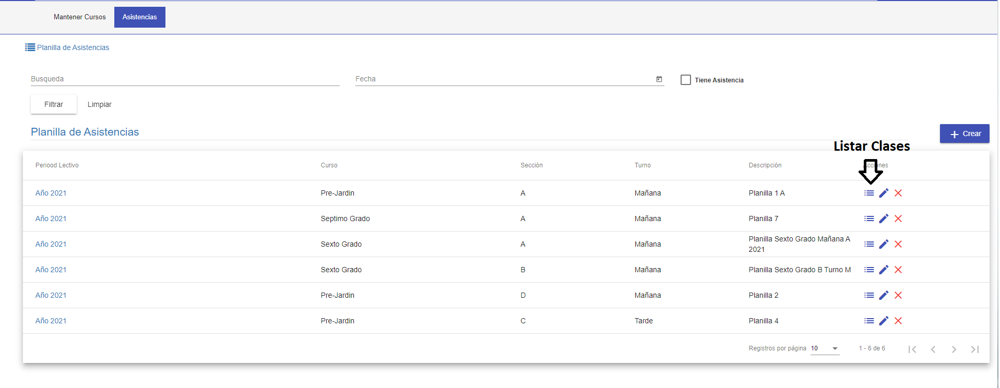
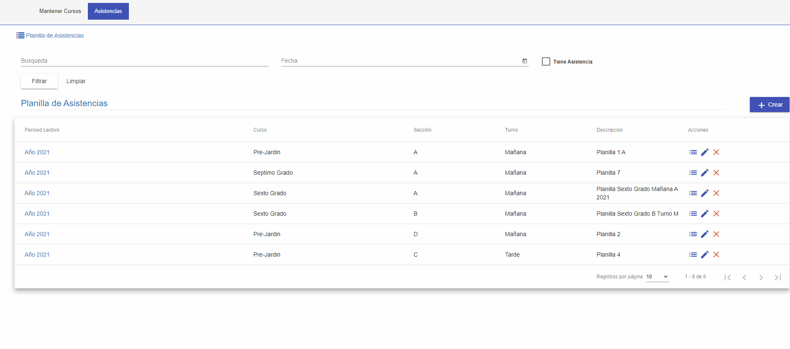
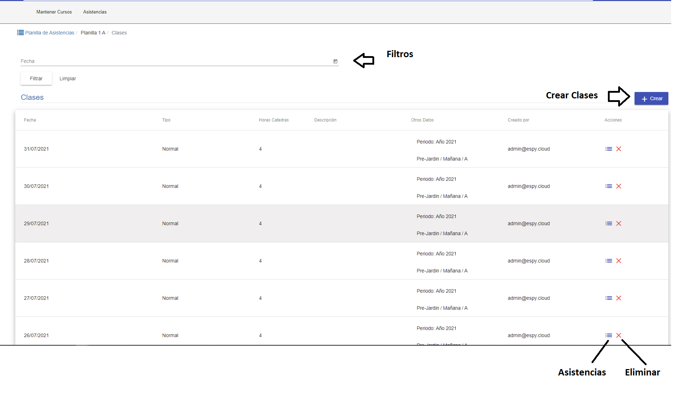
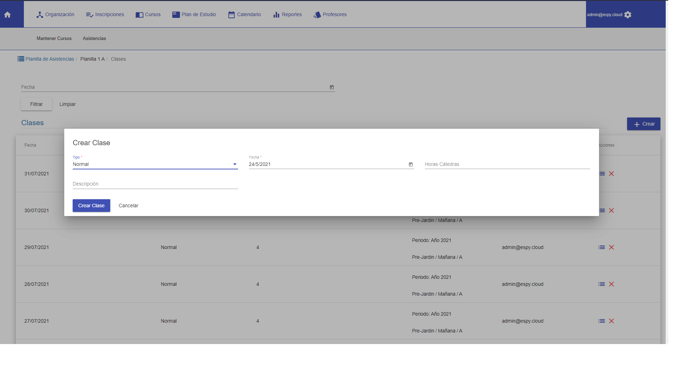
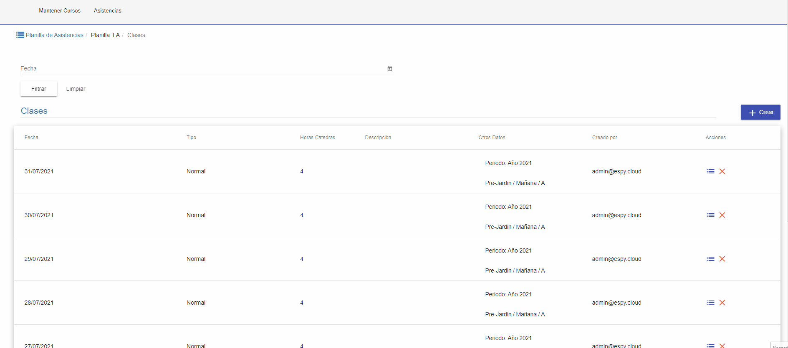

#Clases
@@toc { depth=2 }

La funcionalidad de asistencias cursos permite:

* Listar las asistencias de los alumnos.
* Crear Clases para las asistencias.
* Asignar las asistencias de los alumnos

## Listar Clases

Al acceder a esta funcionalidad se despliega el listado de clases que corresponden a la planilla previamente selecciona. El listado de clases
tiene:

* Una sección de filtros, para buscar por fechas.
* Una grilla, donde se listan las clases de los alumnos.

## Filtros

Los filtros permiten buscar las clases de acuerdo a fechas . Algunos criterios son:

* Fecha . Permite buscar las clases con fecha de inicio mayor o igual al seleccionado.

Luego de completar los filtros requeridos. Se puede pulsar **Filtrar**, para que se muestren los resultados de la
busqueda en la grilla. Si se requiere vaciar o restabler los filtros se puede pulsar **Limpiar** y luego **Filtrar**.

## Grilla

La grilla muestra las clases que corresponden al curso de la planilla.

##Crear Clase
Para crear una clase click en el botón Crear Clase. Se muestra una ventana con los datos a completar para crear
la clase:

1. Tipo. Se Selecciona el tipo de clase.
2. Fecha. Se selecciona la fecha de la clase.

