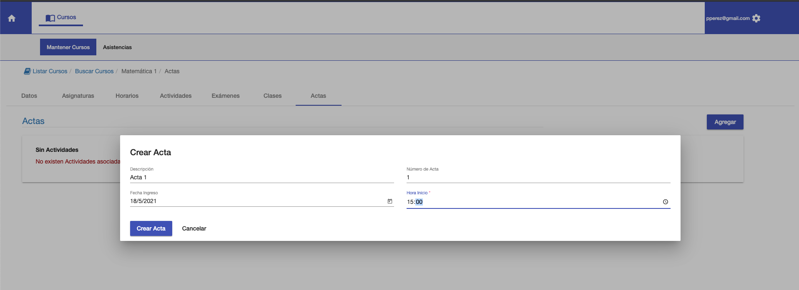

#Crear
Para crear un acta click en **Agregar**. Se muestra una ventana con los datos 
requeridos para crear el acta:

1. Descripción.
2. Número de Acta. Opcional. Si se requiere numerar de alguna manera.
3. Fecha de Ingreso.
4. Hora.

Luego de completar los campos, se habilita el botón **Crear Acta** para crear. Si no se quiere crear, se puede pulsar **Cancelar**
Si se aprieta el botón Crear Acta, se crea el
acta y se muestra el acta en la grilla de listado.
