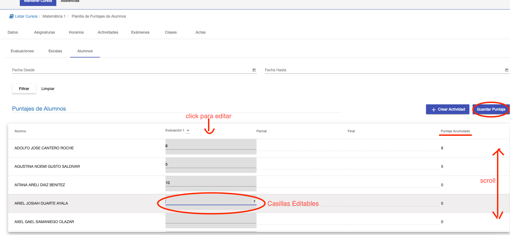
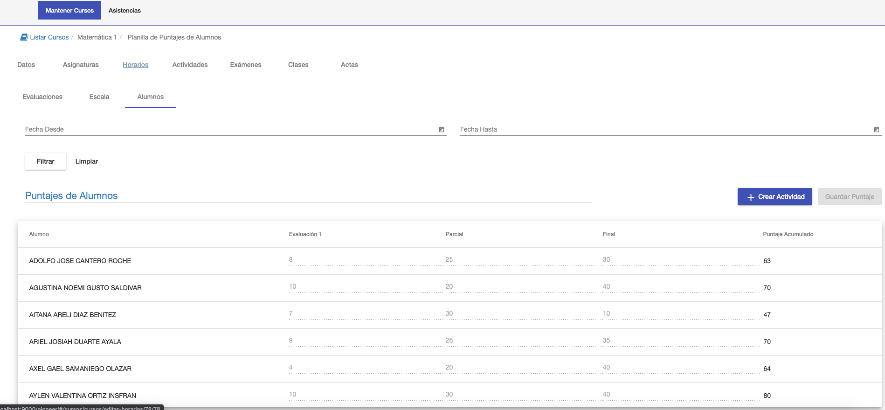

#Alumnos

La sub pestaña Alumnos muestra una grilla de los alummos y las actividades definidas.
La grilla permite asignar los puntajes de los alumnos por actividad.
Para poder asignar o editar los puntajes de los alumnos:

1. Seleccionar la columna de la actividad. La columna se marca como seleccionada y se habilitan las casillas
de cada alumno para dicha actividad. También se habilita el botón Guardar Puntaje.
2. Asignar los puntajes para cada alumno.
3. Click en Guardar Puntaje para guardar los puntajes de los alumnos en dicha actividad.

Luego de hacer click en Guardar Puntaje, se recalculan los puntajes acumulados para cada alumno.

Si se quiere editar puntajes de otra actividad. Se puede hacer click sobre la actividad y se procede de
la misma manera.

Obs. El listado de alumnos puede ser extenso. Entonces se puede hacer **Scroll** en la grilla hacia arriba o hacia abajo
para ir asignando los puntajes de todos los alumnos.

Luego de registrar todos los puntajes de los alumnos, se puede calcular la nota final en la funcionadad Acta.

Grilla con todos los puntajes registrados:

