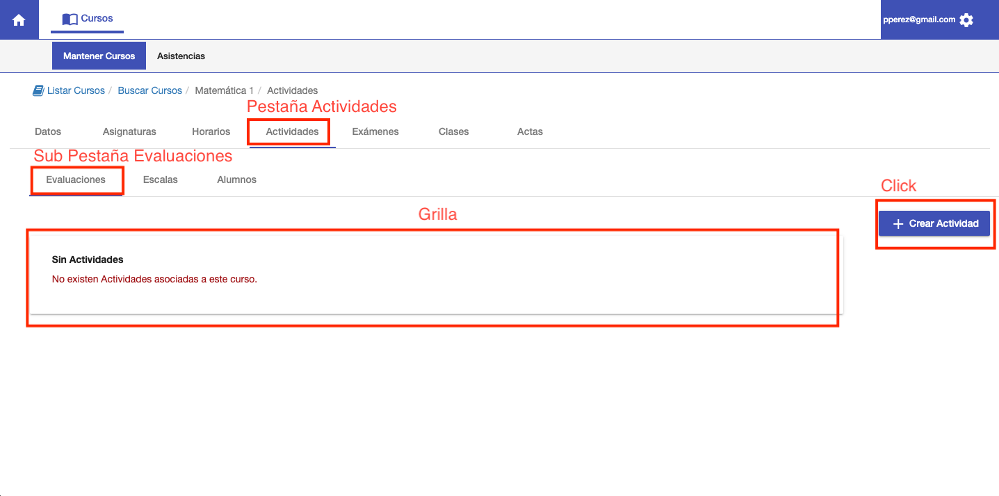
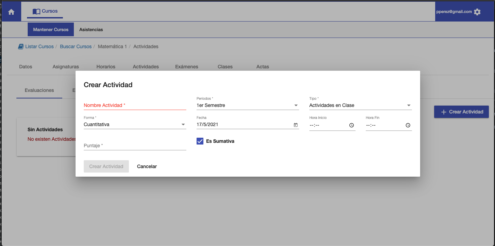
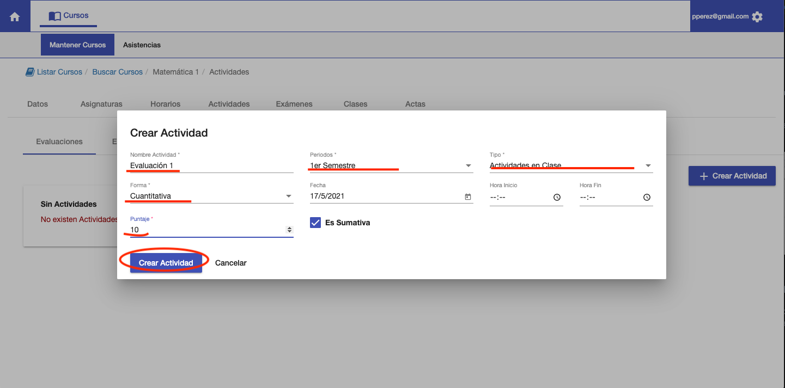
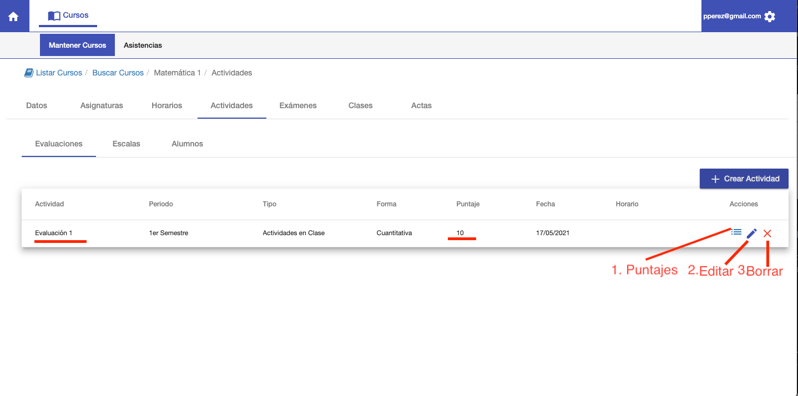

#Evaluaciones

Al ingresar a la sub pestaña Evaluaciones de un curso. Se muestra:

1. Grilla de actividades ya creadas.
2. Botón para crear Actividad.

##Grilla de actividades
En esta grilla se muestran las actividades que se van creando. Si no hay actividades aún, la grilla 
está vacía y se muestra el mensaje: No existen actividades asociadas a este curso.

##Crear Actividad
Para crear una actividad click en el botón Crear Actividad. Se muestra una ventana con los datos a completar para crear
la actividad:

1. Nombre de Actividad. Para diferenciar la actividad de otras.
2. Periodo. Se puede asignar a un periodo, si se requiere agrupar.
3. Tipo. Se puede elegir el tipo de evaluación.
4. Forma. Cuantitativa, si la actividad es por puntaje. Cualitativa, si no es por puntaje.
5. Fecha. La fecha de la actividad.
6. Hora Inicio. Opcional
7. Hora Fin. Opcional
8. Puntaje. El puntaje total de la actividad.
9. Es Sumativa. Si la actividad, se suma a las demás actividades para calcular el puntaje final.

Como ejemplo, vamos a crear una actividad de nombre Evaluación 1 de 10 puntos:

Luego de crear la actividad, se muestra la actividad creada en la grilla:

Desde esta grilla se puede:

1. Asignar Puntajes a los alumnos en la actividad. Esto también se puede realizar en la pestaña Alumnos.
2. Editar la actividad. Editar los campos completados al crear.
3. Borrar la actividad.

