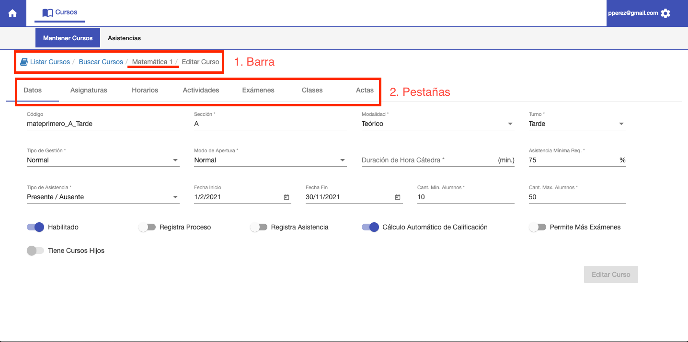

##Editar Curso
Al acceder a un Curso, se muestra un interfaz que contiene:

1. Una barra con el nombre del curso. Para distinguir que curso se está editando.
2. Pestañas para editar distintos datos del curso.

La barra se puede utlizar para navegar de vuelta al listado de cursos.
Las pestañas del curso son:

1. Datos. Datos con los que se configuró un curso, como Sección, Turno etc. Para uso de Administrador de Sistema.
2. Asignaturas. La asignatura que está asociada al curso. Por ej Matemática. También es 
para uso de Administrador de Sistema.
3. Horarios. Permite registrar los horarios de clase para la asignatura. Esta pestaña no se utiliza
para CELE, ya que los horarios son por curso y no por asignatura.   
4. **Actividades. Pestaña para registrar la Escala de Calificaciones, Actividades de Evaluación y Puntajes
de Alumnos. Esta pestaña puede utilizar el profesor.**
5. Exámenes. Esta pestaña se refiere a inscripciones a exámenes. Que no se utiliza en
Cele.
6. Clases. Permite registrar asistencia para la asignatura. No se utiliza para CELE, ya que la asistencia
   es por curso y no por asignatura.
7. **Actas. Permite registrar un acta que calcula las calificaciones finales de los alumnos. De acuerdo
a sus puntajes en las actividades. Esta pestaña puede utilizar el profesor**