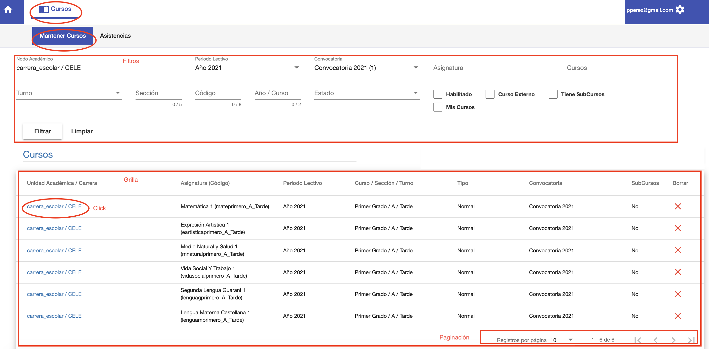

# Mantener Cursos

@@toc { depth=2 }
@@@ index
* [Editar](editar.md)
* [Actividades](actividades/index.md)
* [Actas](actas/index.md)
@@@

La funcionalidad de mantener cursos permite:

* Listar los cursos del profesor.
* Acceder a un curso. Para editar.

## Listar cursos

Al acceder a esta funcionalidad se despliega el listado de cursos que corresponden al profesor. El listado de cursos
tiene:

* Una sección de filtros, para buscar cursos.
* Una grilla, donde se listan los cursos/asignaturas que da el profesor.

## Filtros

Los filtros permiten buscar cursos de acuerdo a varios criterios, que pueden combinarse. Algunos criterios son:

* Asignatura. Permite buscar cursos por nombre de asignatura.
* Turno. Permite buscar cursos por turno.
* Sección. Permite buscar cursos por sección.
* Cursos. Al completar Nodo Académico, Periodo Lectivo y Convocatoria, se habilita el filtro Cursos. Que permite buscar
  por Nivel o Grado, Ej: Quinto Grado.

Luego de completar los filtros requeridos. Se puede pulsar **Filtrar**, para que se muestren los resultados de la
busqueda en la grilla. Si se requiere vaciar o restabler los filtros se puede pulsar **Limpiar** y luego **Filtrar**.

## Grilla

La grilla muestra los cursos que corresponden al profesor. La grilla se actualiza con los resultados de una busqueda con
los filtros. Los resultados se muestran de manera paginada, es decir en grupos de a 10 o 20, que se pueden ir paginando
como un libro, con los botones de **Paginación**

Al hacer click en un curso en la grilla, se accede a editar ese curso.