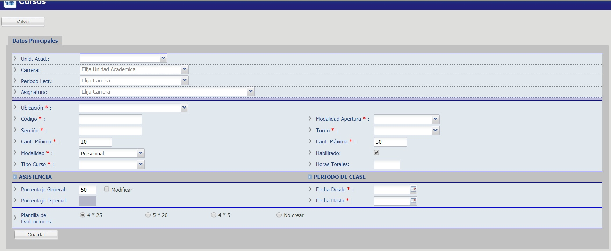

# Cursos - Crear

Para crear cursos debe dirigirse al @ref:[Listado de Cursos](index.md#listado-de-cursos) y hacer click en el botón "Crear Curso".

Seguidamente se le presentará el siguiente formulario, complete todos los campos, haga click en el botón "Guardar" y listo.

## Desde Buscador de Curso

Desde el buscador de cursos, usted puede hacer click en la opción "Crear Curso", el cuál le mostrará el formulario correspondiente para la creación del nuevo curso.

## Observaciones

* Botón Borrar Curso: En caso de haber creado, por error, un curso y desea eliminarlo del sistema debe utilizar el botón “Borrar Curso” y confirmar la operación en una ventana emergente. 
    
    _Observación: Un curso solo puede ser borrado si no tiene ninguna información relacionada (horarios, alumnos inscriptos, curso asociado, profesores, etc.)._
    
    **Importante:** En caso de recibir un error al borrar un curso, revise las demás pestañas para verificar que no tengan otros datos relacionados.
* Campo “Habilitado”: El campo habilitada o no, permite que un curso deje de aparecer en el listado de cursos disponibles para inscripción. 
  Si un curso con alumnos es dado de baja, por ejemplo por tener pocos alumnos, el mismo no puede ser borrado (ya que en algún momento tuvo inscriptos), en este caso entonces debe utilizar el campo “Habilitado” de “Datos Principales” desmarcando la casilla correspondiente, para que este curso no pueda ser utilizado por error para nuevas inscripciones. 
  
     _Observación: Antes de deshabilitar el curso, verifique que en el mismo no hayan alumnos a los cuales haya que dar de baja antes, ver @ref[Dar de Baja a un Alumno](../alumno/manejarPendientes.md#dar-de-baja-a-alumno)._

* Periodo de clase - Ingresar la fecha del primer dia de clase y la fecha del ultimo dia de clases.

* Plantilla de evaluaciones: Sirve para pre-cargar las evaluacion de un curso, las opciones:
    * 4*25: Crear 4 evaluaciones de 25 puntos cada uno.
    * 5*20: Crea 5 evaluaciones de 20 puntos cada una.
    * 4*5: Crea 4 evaluaciones de 5 puntos cada una (para cursos de Young Learners).
    * No crear: No crea ninguna evaluación, las mismas luego se pueden agregar en la pestaña @ref:[Evaluaciones](./cursosVer/evaluaciones.md).
