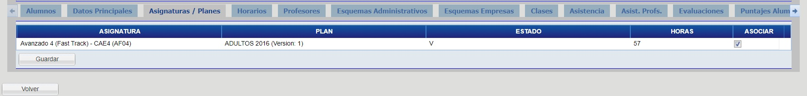

# Asignatura Planes

Haga click en la pestaña "Asignaturas / Planes" para visualizar los datos de los planes de asignatura.

Desde esta pestaña es posible editar los datos de las asignaturas, modifique lo que desee y haga click en el botón guardar.

_Observación: Un curso debe estar asociado a una carrera/plan para poder ser utilizado. 
Para todos los cursos que vaya creando, verifique en esta pestaña que el curso esté asociado al mismo (cuadro “Asociar” en la ultima columna de la tabla de la imagen con el titulo “Asociar”).
Para hacerlo, marque el cuadro correspondiente hasta ver el campo tildado, y presione GUARDAR._
