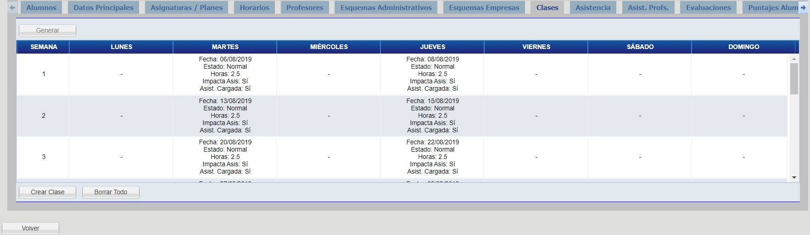
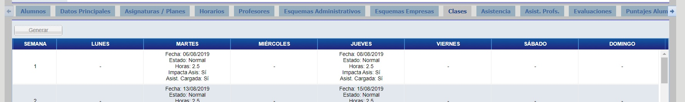
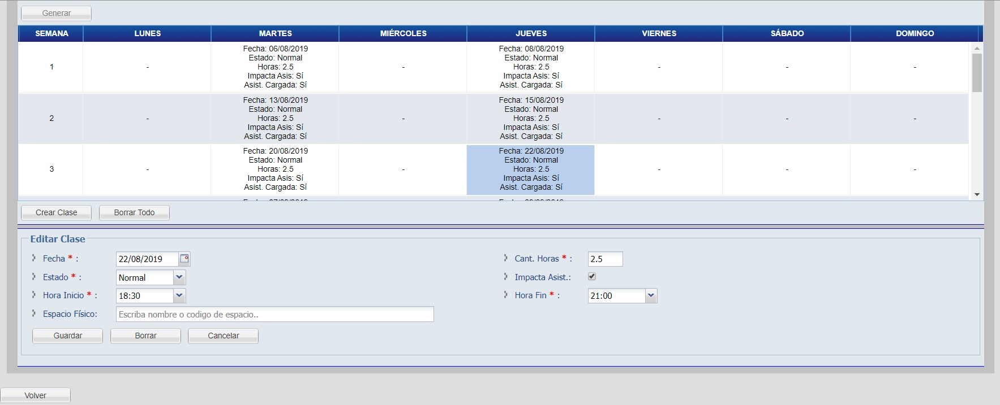
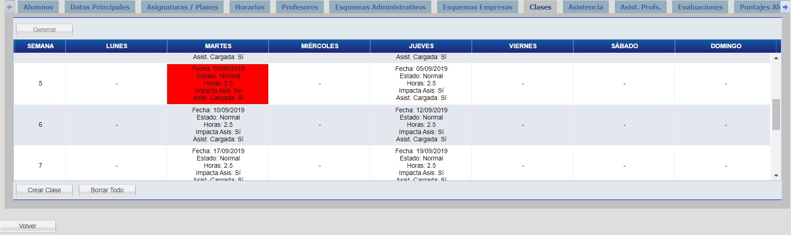
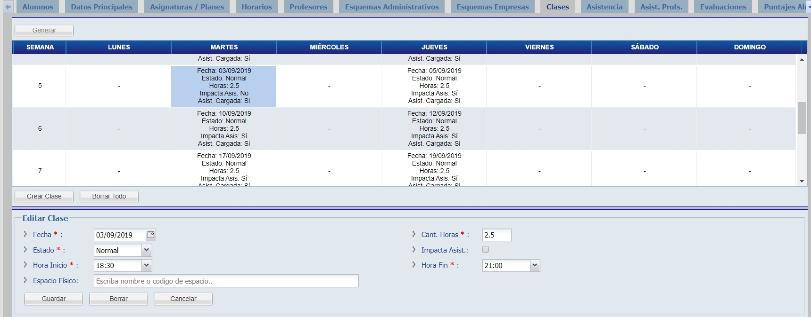
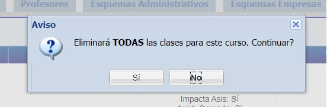

# Clases

Haga click en la pestaña "Clases" para visualizar las clases del curso.

## Generar Clase

Para generar las clases haga click el en botón "Generar" y haga click en el botón "Guardar".

_Observación: El botón “Generar” solo se encuentra habilitado cuando un curso NO tiene NINGUNA clase creada, y permite crear todas las clases del mismo, en base a su @ref:[Horario](horarios.md) (el cual debe estar definido), y a su fecha de inicio y fecha de fin establecidas en @ref:[Datos Principales](datosPrincipales.md)._

Al presionar generar, se completará con todas las clases en base a los puntos arriba mencionados, las cuales definirán los días en los que se llamará asistencia para este curso.

## Crear Clase

_En caso que encuentre que alguna fecha de clases no este creada, puede agregar en forma individual fechas de clase utilizando este proceso._

Para crear la clase, haga click en el botón "Crear Clase", complete los campos y haga click en el botón "Guardar".

## Editar Clase

Para editar la clase, seleccione la clase, modifique los campos y haga click en el botón "Guardar".

## Clases sin Asistencia

De esta manera se visualizan las clases que no impactan a la asistencia de los alumnos y que aún no estan confirmadas, es decir, clases en las cuales no se computan asistencia (no cuentan como presentes ni ausentes los alumnos en dicha clase, ni cuentan para el total de horas del curso). 

Utilizar esta opción para días de clase que hayan sido feriados, asuetos, o días en los cuales no se haya dictado dicha clase (por ausencia del profesor o cualquier otra causa de fuerza mayor), o para clases donde el profesor no haya llamado asistencia.

## Borrar Todo

Para borrar todas las clases haga click en el botón "Borrar Todo" y confirme la transacción.

_Observación: Solo se pueden borrar clases en las cuales no se haya cargado ninguna @ref:[Asistencia](asistencia.md) para los alumnos._
