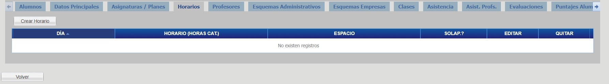
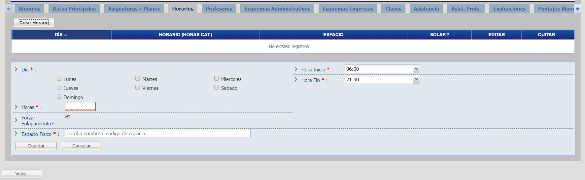
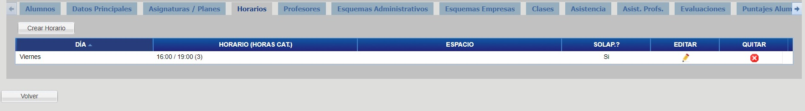

# Horarios

Haga click en la pestaña "Horarios" para visualizar los horarios del curso.

## Crear Horario

Para crear un horario haga click en el botón "Crear Horario", complete los campos y haga click en el botón "Guardar".

Finalmente, podrá observar el horario agregado para el curso.

## Borrar Horario
Utilizar la cruz roja para poder borrar un horario creado, confirmando la operación en la ventana emergente.

## Editar Horario
Utilice el icono del lápiz para editar un horario ya creado al cual quiera hacerle alguna modificación.

_Observación: En caso de encontrar que le falta alguna Aula para utilizar en el campo “Espacio Físico”, contacte con su administrador de sistemas._
