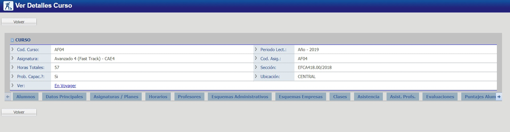

# Cursos - Ver

Esta es la interfaz principal de un Curso.

Cada bloque (pestaña) y su información está en los enlaces mencionados a continuación.
 
_Observación: De acuerdo al tamaño de la pantalla (monitor), puede que no todas las pestañas sean visibles al mismo tiempo, haciendo referencia a las flechas azules que aparecen a la izquierda y derecha de la lista de pestañas y que las mismas pueden ser utilizadas para recorrer las pestañas de izquierda a derecha y viceversa._

@@toc { depth=1 }
@@@ index
* [Alumnos](./alumnos.md)
* [Datos Principales](./datosPrincipales.md)
* [Asig Planes](./asigPlanes.md)
* [Horarios](./horarios.md)
* [Profesores](./profesores.md)
* [Esquemas Adm](./esquemasAdm.md)
* [Esq Empresas](./esqEmpresas.md)
* [Clases](./clases.md)
* [Asistencia](./asistencia.md)
* [Asist Prof](./asistProf.md)
* [Evaluaciones](./evaluaciones.md)
* [Puntajes Alumnos](./puntajesAlumnos.md)
* [Ex Extraordinarios](./exExtraordinarios.md)
@@@

Para acceder a la información de un curso vea @ref:[aquí](../index.md)
