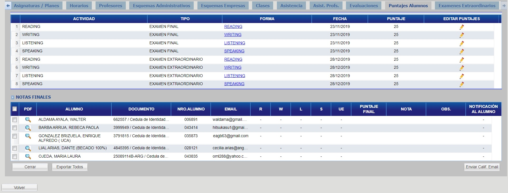
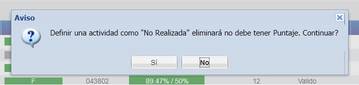
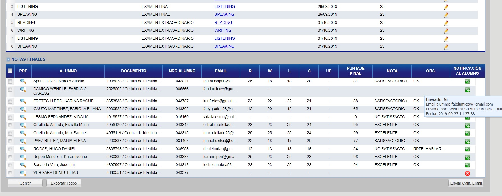
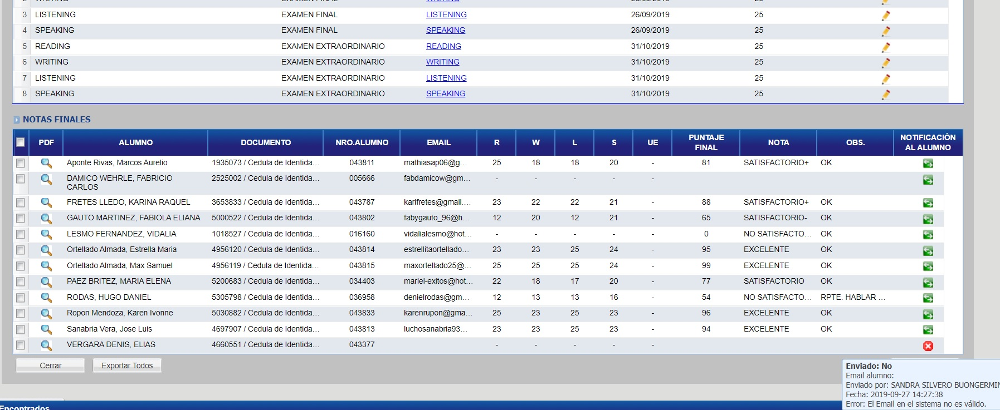

# Puntajes Alumnos

Para ver los puntajes de los alumnos, haga click en la pestaña "Puntajes Alumnos"

## Editar Puntaje

Para editar el puntaje de un alumno, haga click en el botón con ícono de "Lápiz", correspondiente al puntaje del alumno a modificar, haga las modificaciones y haga click en el botón "Guardar".

Agregar valores haciendo doble click en las columnas indicadas con el icono del lapiz (Puntaje, Estado, Realizado, Observacion)

### % Asis
En la columna % Asist. se muestra el porcentaje de asistencia de cada alumno, respecto al total que debe cumplir en el curso.
Las celdas en color verde indican alumnos que cumplieron dicho requisito, en rojo los que no lo hicieron.

### Actividad no realizada

Si desea marcar un puntaje como actividad no realizada, en la columna "Realizado", modifique el valor a "No" correspondiente al alumno que desea aplicarlo.

Haga click en el botón "Si" para confirmar.

_Observación: una actividad no realizada indica que el alumno no ha hecho la misma (ausente). En el caso de actividades NO Realizadas, el alumno específico no puede tener ningún puntaje en el campo “Valor”_

### Puntaje
El campo Puntaje espera un valor numérico que indica el puntaje que el alumno obtuvo en dicha evaluación, desde 0 (cero) hasta el máximo de puntos definidos en la evaluación (este valor se muestra más arriba en la grilla de Evaluaciones).

### Estado
El campo estado indica que un puntaje es válido y debe contar para el puntaje total del alumno, y por tanto utilice siempre el valor “Válido” para esta columna.

### OBS.
El campo observación permite registrar una observación asociada al puntaje.
Esta observacion es la que sale en la ficha del alumno, y se registra la última cargada por cada alumno en cada curso.

_Nota: Para los alumnos que no cumplen asistencia, columna % Asist en rojo, debe obligatoriamente incluir algún texto en este campo._

_Observación general: Los alumnos en estado D - Desincripto no pueden tener nuevos puntajes cargados, recuerde agregar puntajes u observaciones para estos alumnos antes de darlos de @ref:[Dar de Baja](../../alumno/manejarPendientes.md#dar-de-baja-a-alumno)_
## Notificar por Email

Para notificar por email, seleccione los alumnos y haga click en el botón "Enviar Calif. Email"

Si el email fue enviado, lo podrá visualizar desde el campo "Notificación Al alumno":

En caso que aún no haya sido enviado, lo podrá visualizar desde el mismo campo, pero de la siguiente manera:

## Reportes

Para ver la lista de reportes de la pestaña "Puntajes Alumnos" haga click @ref:[aqui](../reportes/cursosVer/puntajesAlumnos.md).

