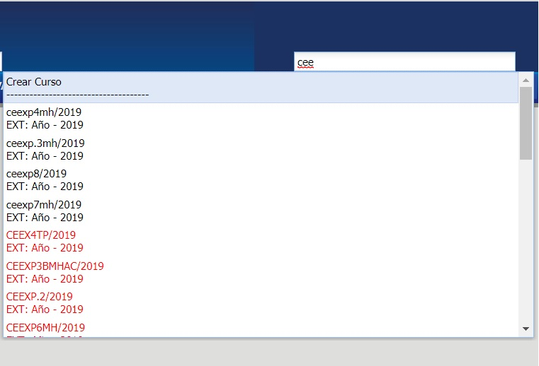

# Cursos

@@toc { depth=1 }
@@@ index
* [Crear Curso](./cursosCrear.md)
* [Ver Curso](cursosVer/index.md)
* [Reportes](reportes/index.md)
@@@

## Buscador de Curso
Sirve para realizar la búsqueda de Cursos en el sistema académico.

Puede introducir el nombre o código del curso para realizar la búsqueda.

_Observación: el buscador puede mostrar valores de las siguientes maneras:_

* Texto en color negro: son valores actuales.
* Texto en color rojo: son valores pasados.

## Listado de Cursos
  
Para visualizar todos los cursos del sistema, debe acceder al módulo _"Estadisticas"_, en la funcionalidad _"Ver Detalles de Curso "_

En el cuadro superior, en la sección de _"Búsqueda"_ usted podrá completar campos como: Periodo Electivo, Asig. Nombre, Codigo, Habilidados, etc. Para filtrar los, debe hacer click en el botón _"Buscar"_.

_Observación: El botón "Limpiar" se puede utilizar para vaciar los campos que fueron completados en la sección de "Búsqueda"_

Para ver los reportes que pueden ser generados desde el _Listado de Cursos_ haga click @ref:[aqui.](./reportes/indicePrincipal/index.md)

