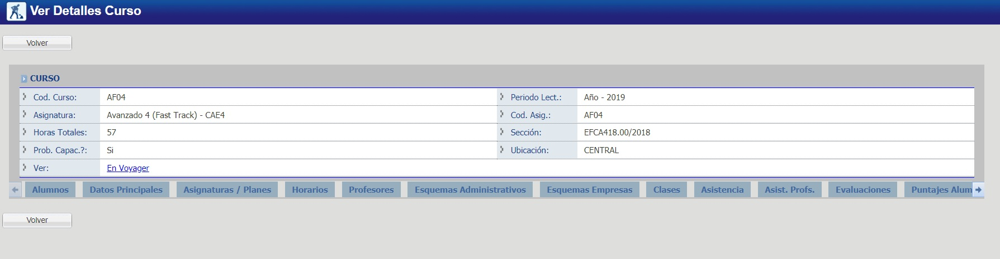

# Cursos Ver

Desde @ref:[Ver Un Curso](../../index.md#listado-de-cursos) se pueden generar los siguientes reportes:

@@toc { depth=1 }
@@@ index
* [Alumnos](./alumnos.md)
* [Puntajes Alumnos](./puntajesAlumnos.md)
@@@
