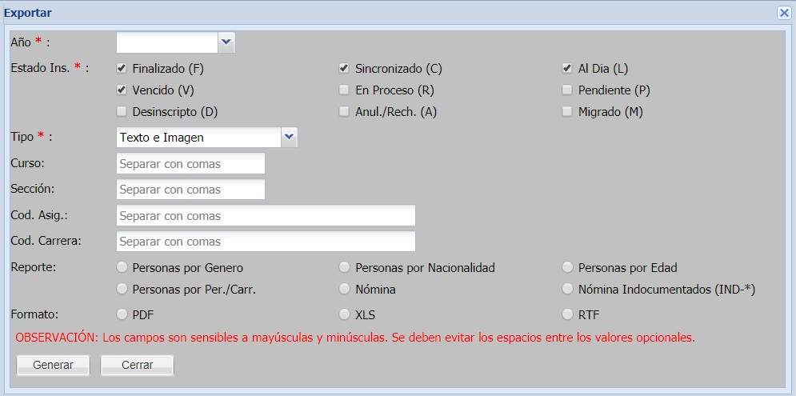

# Generales

Haga click en el botón "Generales", complete los campos:

Los tipos de reportes que pueden sen generados son:

* Personas por Genero
* Personas por Nacionalidad
* Personas por Edad
* Personas por Per./Carr.
* Nómina
* Nómina Indocumentados (IND-*)

