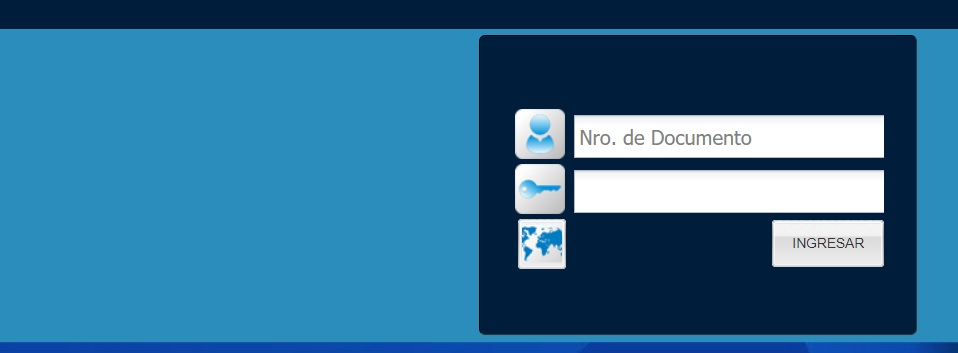
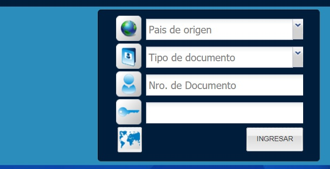
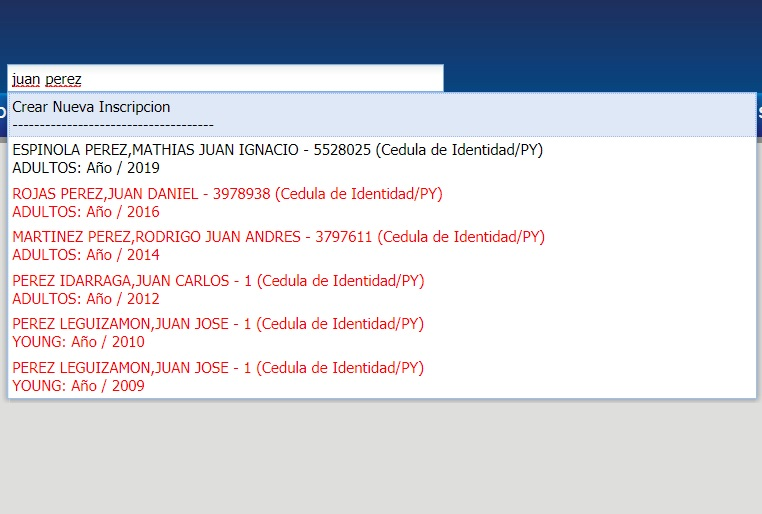

# Ingreso

## Ingreso al Sistema
 
 Para acceder al sistema debe de introducir su número de Cédula de Identidad Paraguaya, contraseña y hacer click izquierdo en el botón "Ingresar".

  

 Si posee documento extranjero o un documento nacional distinto a la Cédula de Identidad, debe presionar el botón "Mapa Mundi" para obtener el siguiente formulario.
 
 Deberá completar los campos con el país de Origen del Documento, tipo de documento, número de documento y contraseña;  y hacer click izquierdo en el botón “Ingresar”.
 
 
 
 _Observación: En caso de no saber con que documento fue registrado como usuario, consultar con su administrador._

## Salida del Sistema

Para cerrar sesión dar click en el boton "Salir" ubicado en la página principal del Sistema Académico, al darse esta salida automáticamente se cierra tambien la sesión de Voyager.

_Observación: Para cerrar la sesión se recomienda hacerlo desde el sistema académico, debido a que también cierra la sesión en Voyager. Si se hace a la inversa, es decir, cerrando sesión en Voyager, no cerrará la sesión en el sistema académico._

## Accediendo a Voyager

El acceso directo a Voyager, se puede realizar luego de iniciar sesión en el sistema academico, haciendo click en "Voyager".

_Observación: Se requieren los permisos necesarios para acceder al sistema administrativo (Voyager)._

##  Layout Principal
  Desde esta interfaz se tendrán los accesos para navegar al sistema administrativo, alumnos, cursos y salir del sistema.

## Buscador de Alumno
Sirve para realizar la búsqueda de Alumnos en el sistema académico.

Puede introducir el nombre, documento o código del alumno para realizar la búsqueda.

_Observación: el buscador puede mostrar valores de las siguientes maneras:_

* Texto en color negro: son valores actuales.
* Texto en color rojo: son valores pasados.

## Buscador de Curso
Sirve para realizar la búsqueda de Cursos en el sistema académico.

Puede introducir el nombre o código del curso para realizar la búsqueda.

_Observación: el buscador puede mostrar valores de las siguientes maneras:_

* Texto en color negro: son valores actuales.
* Texto en color rojo: son valores pasados.
