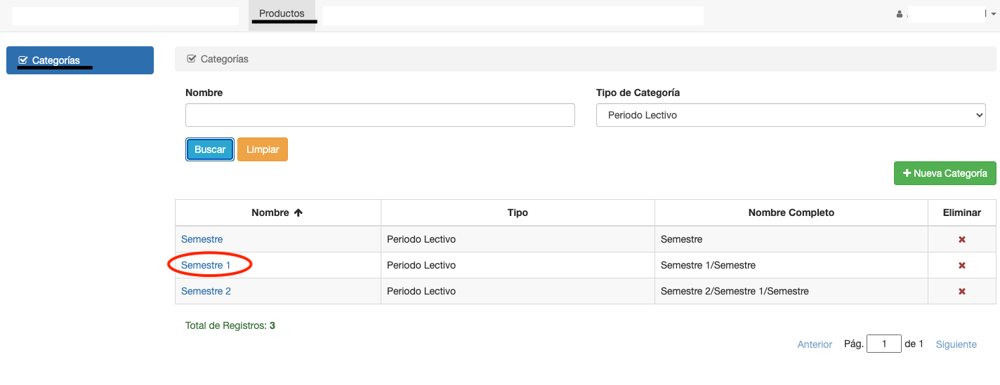
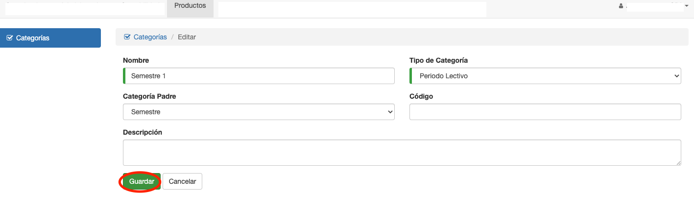

# Editar Categoría

Para editar una categoría, se ingresa a la categoría desde la grilla de categorías.

Luego se modifican los campos necesarios y se pulsa el botón Guardar.

**Observaciones**

* El sistema valida que no se utilicen nombres ya utilizados por otras categorías.
* Al cambiar una categoría, esto afecta a los productos que ya fueron categorizados. Los productos ahora
van a corresponder a la categoría cambiada.