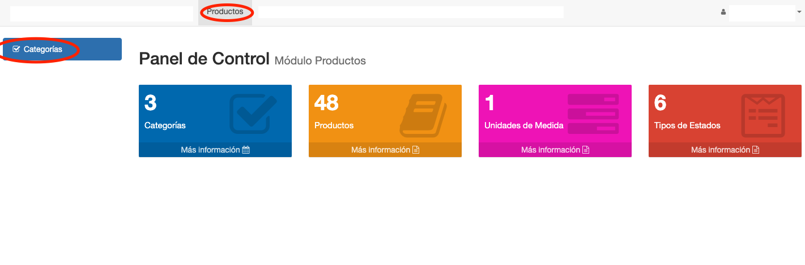

# Categorias

@@toc { depth=1 } 
@@@ index
* [Listar Categorías](listar_categorias.md)
* [Crear Categoría](crear_categoria.md)
* [Editar Categoría](editar_categoria.md)
* [Borrar Categoría](borrar_categoria.md)
@@@

## Introducción

Las categorías permiten clasificar los productos. Cada categoría se asocia a un Tipo de Categoría. El tipo de categoría,
podría entenderse como la dimensión o perspectiva de la categoría. Ejemplos:

* Las categorías Primer Grado, Primer Año pueden pertener al tipo de categoría Grado.
* Las categorías Primaria, Secundaria pueden pertener al tipo de categoría Ciclo.

Esto permite catalogar productos en dos dimensiones, Grado y Ciclo. Ejemplos:

* Primer Grado y Primaria.
* Primer Anho y Secundaria.

Las categorías en Voyager pueden definirse de manera jerárquica. Podríamos definir un tipo de categoría para representar
la dimensión de Periodos Lectivos de manera jerarquica. Ejemplos:

1. Creamos una categoría `Semestre`.
2. Luego creamos una subcategoría `Semestre 1` hija de `Semestre` y obtenemos la categoría `Semestre\Semestre 1`.
3. Luego creamos una subcategoría `Semestre 2` hija de `Semestre` y obtenemos la categoría `Semestre\Semestre 2`.

## Acceso
Para acceder a esta funcionalidad, se ingresa a al módulo Productos y luego a Categorias.

