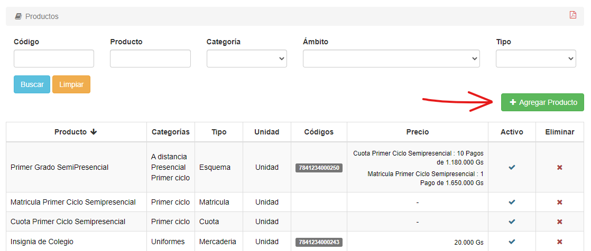
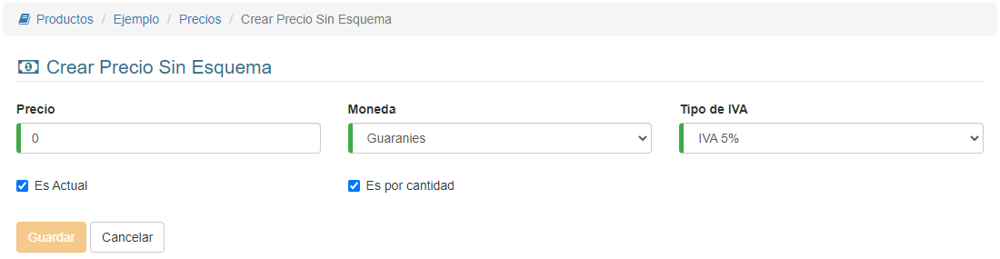
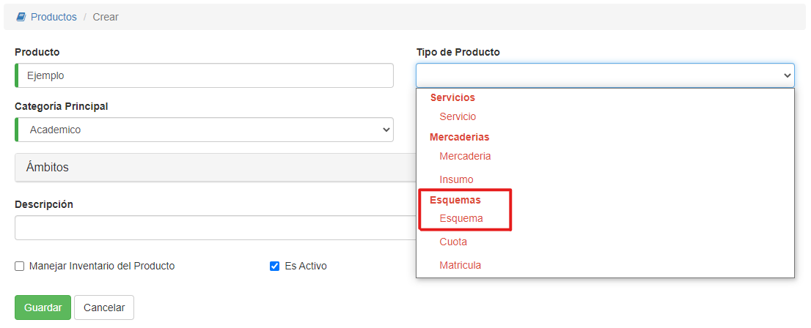
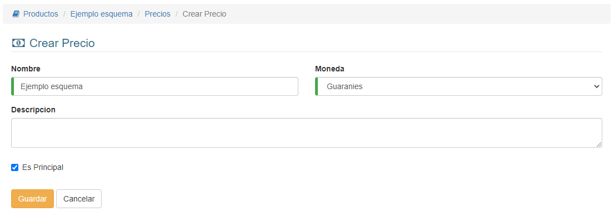
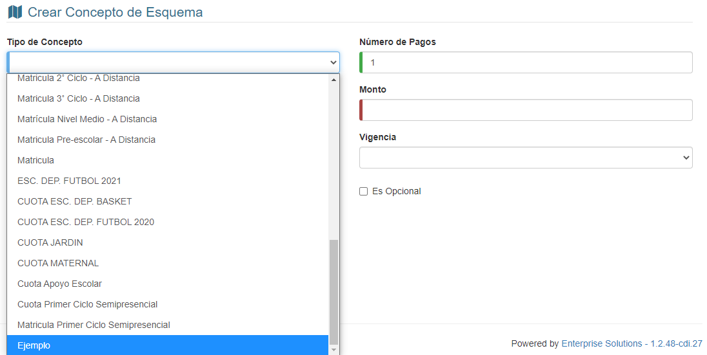
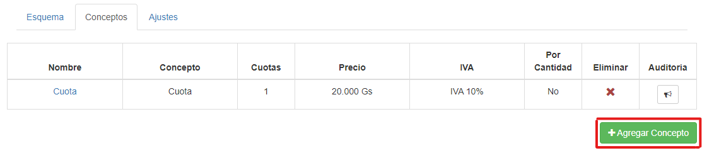

# Crear Productos

Para crear un producto, hacemos clic en el botón **Agregar Producto**:

*Al presionar el botón:*

Aquí debemos rellenar los datos y hacer clic en **Guardar**.

Dependiendo del **Tipo de producto** escogido, los pasos a continuación cambiarán:

## Producto con Precio unitario

Si escogimos un tipo de producto de las secciones **Servicios** o **Mercaderías**, el sistema nos pedirá añadir un precio al producto:

Aquí debemos ingresar un precio mayor a 0, modificar los datos que queramos y, al terminar, presionar **Guardar**.

## Producto Concepto de esquema

Si escogimos un tipo de producto **Cuota** o **Matrícula**, es porque queremos agregarlo a un producto **Esquema**.
El sistema nos permitirá agregar un precio, igual que si fuera un producto de Precio Unitario:

Aquí no es necesario agregar un precio, podemos presionar **Cancelar**.

Aunque, si queremos, podemos ingresar un precio mayor a 0, modificar los datos que queramos y, al terminar, presionar **Guardar**.

## Producto Esquema

Si escogimos un tipo de producto **Esquema**, el sistema nos mostrará una interfaz para agregar precio:

Este **"Precio"** corresponde a un conjunto de precios, donde agregaremos los **Conceptos de esquema** más adelante. Una vez escojamos un nombre y una moneda, podemos continuar haciendo clic en **Guardar**.

Luego agregamos los **Conceptos de esquema** (Debemos haberlos creado previamente):

En el campo **Tipo de Concepto**, escogemos el concepto que habíamos creado antes:

Podemos ingresar también el número de pagos a realizarse, así como el monto a pagar.

Después de ingresar los datos, hacemos clic en **Guardar**.

Si queremos agregar más conceptos, hacemos clic en **Agregar Concepto** y repetimos lo anterior:

