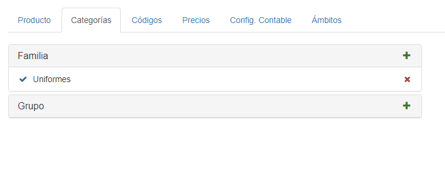
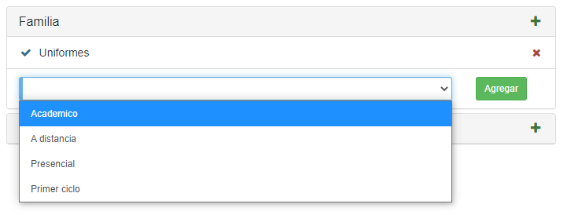
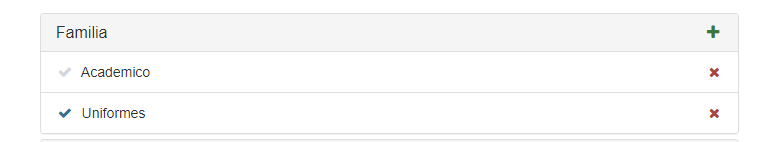

## Categorías
Si hacemos clic en la pestaña **Categorías**, veremos esta interfaz:

Podemos agregar una nueva categoría haciendo clic en el icono **'+'**.
Luego seleccionamos la categoría deseada, y hacemos clic en **Agregar**:

La categoría será agregada:

Si queremos eliminar una categoría, debemos hacer clic en el icono de **'X'** y  confirmar la acción cliqueando **Aceptar**.