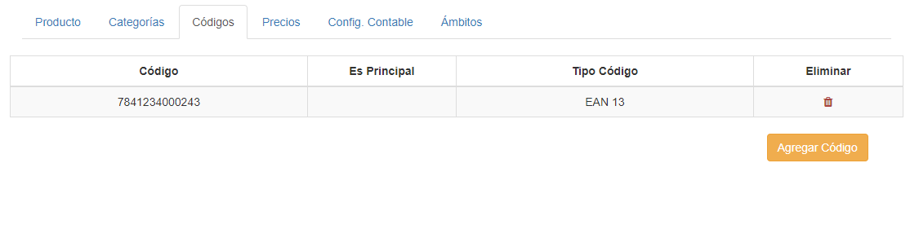
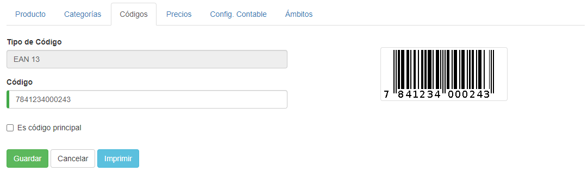
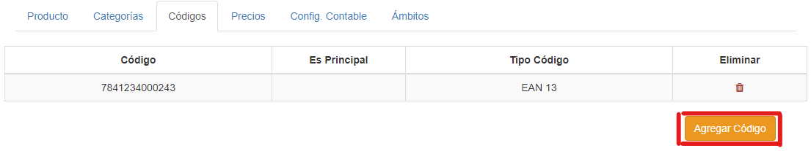
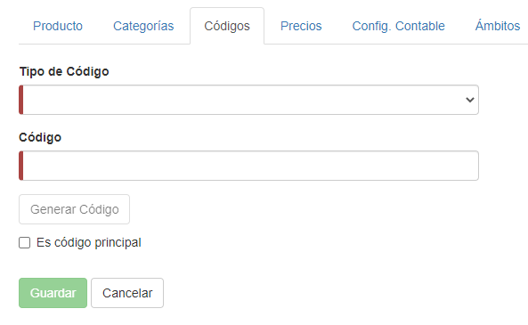
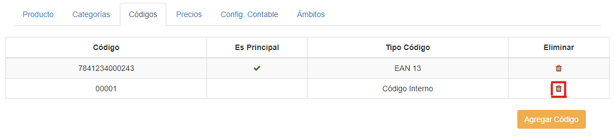

## Códigos
Si entramos en la pestaña **Códigos**, veremos esta interfaz:

Aquí se listan los códigos del producto, podemos ver un código específico si hacemos clic sobre este:

Desde aquí podemos modificar el código o imprimirlo.
Para volver presionamos **Cancelar**.

Podemos agregar un código al producto, haciendo clic en **Agregar Código**:

Una vez aquí, debemos seleccionar el tipo de código, escribir o generar un código automático (para generar el código, se debe hacer clic en **Generar código**, se recomienda crear los códigos de esta manera), y si es necesario, marcar el código como principal (sólo puede haber 1 código principal en un mismo producto).

Al finalizar, hacemos clic en **Guardar**.

Si queremos borrar un código, solo tenemos que hacer clic en el icono de la papelera correspondiente al registro:

*El código a eliminar no puede estar marcado como principal.*
