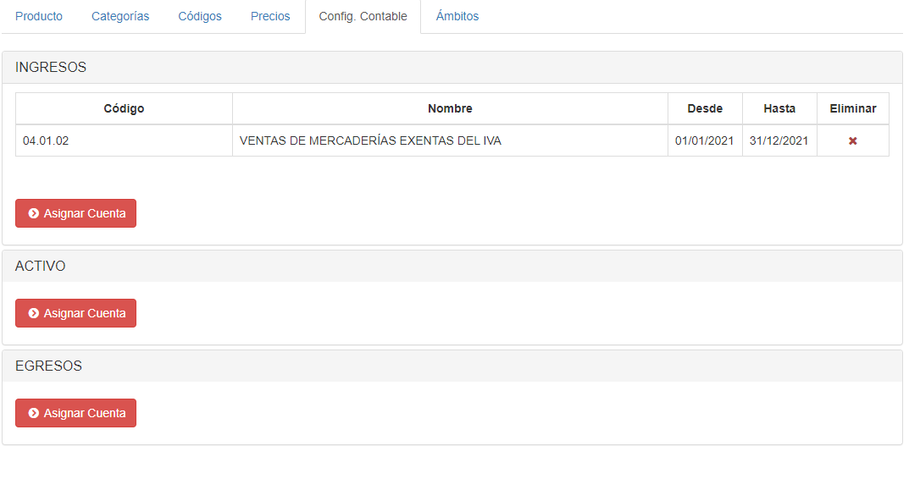
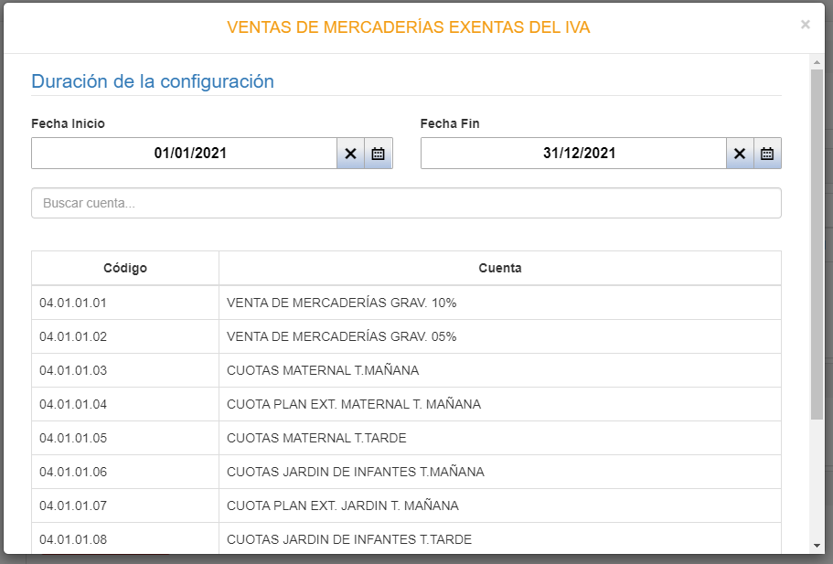
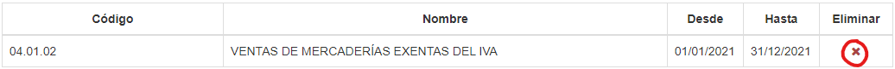
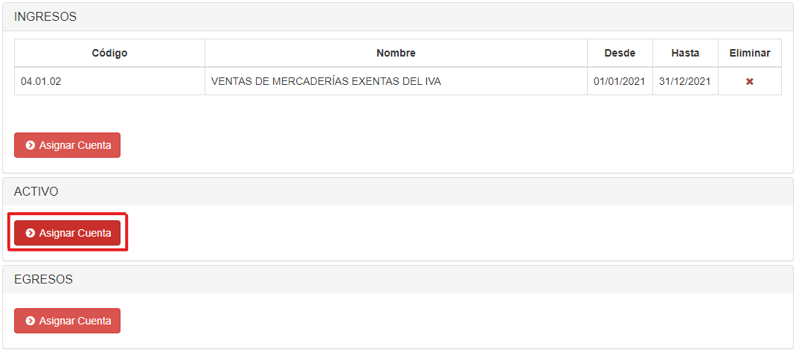
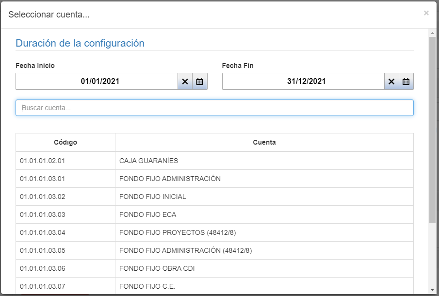
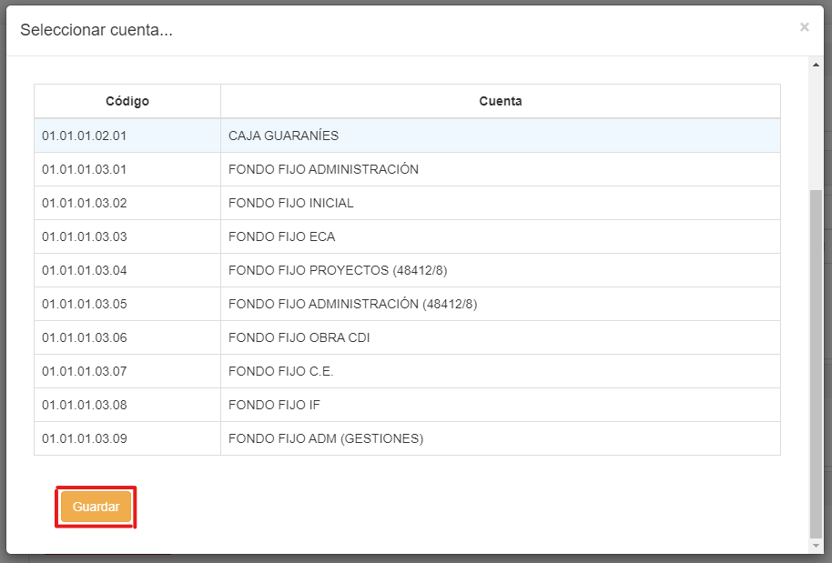

## Configuración Contable

Si entramos a la pestaña **Config. Contable**, veremos esta interfaz:

*La cantidad de secciones depende del tipo de producto, hay tipos de producto que no tienen configuración contable asociada. En el caso de la imagen, el tipo de producto sí tiene configuración contable, y tiene 3 secciones (Ingresos, Activo y Egresos).*

Podemos cambiar los detalles de una cuenta haciendo clic sobre el registro, cambiando los datos y, por último, presionando **Guardar**:

Si queremos eliminar una cuenta, podemos hacer clic en el icono **'X'** bajo la columna **Eliminar**:

Para agregar una cuenta, debemos hacer clic en el botón **Asignar Cuenta**, en la sección deseada:

Luego escogemos fechas de inicio y fin, buscamos la cuenta deseada y hacemos clic sobre ella:

Al finalizar, hacemos clic en el botón **Guardar**.