## Precios

### Precio unitario
Si hacemos clic en la pestaña **Precios**, veremos esta interfaz:

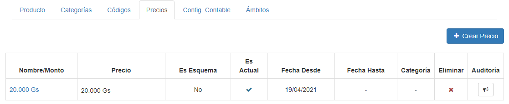

Podemos visualizar un precio específico haciendo clic en su **Nombre/Monto**:

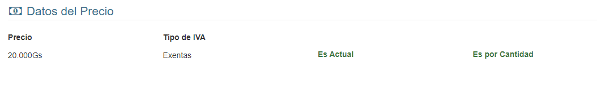

Podemos editar las fechas (Desde y Hasta) y la categoría del precio. Para esto hacemos clic sobre sus campos correspondientes, en la lista:

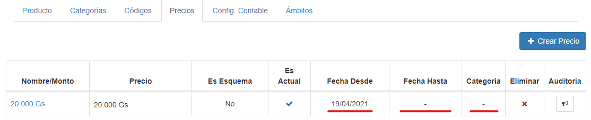
*También podemos marcar un precio como actual, haciendo clic en su icono de viñeta, en la columna **Es Actual** (exclusivo para cuando hay más de un precio y queremos cambiar de precio principal)*

Si queremos eliminar un registro, debemos hacer clic en el icono rojo en forma de **'X'**, de la columna **Eliminar**.

Para agregar un precio, debemos hacer clic en el botón **Crear Precio**.

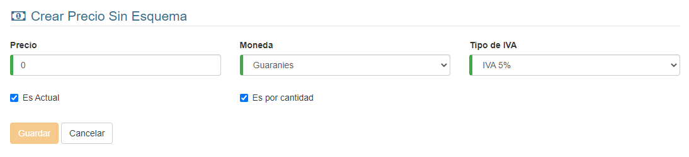

Después de ingresar los datos, hacemos clic en **Guardar**.

### Precio Esquema
Si hacemos clic en la pestaña **Precios**, veremos esta interfaz:

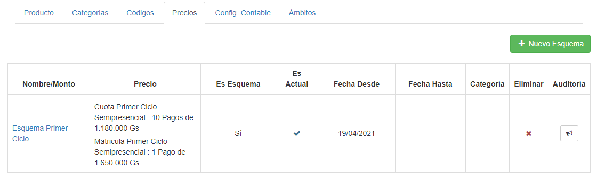

Podemos visualizar un precio específico haciendo clic en su **Nombre/Monto**:

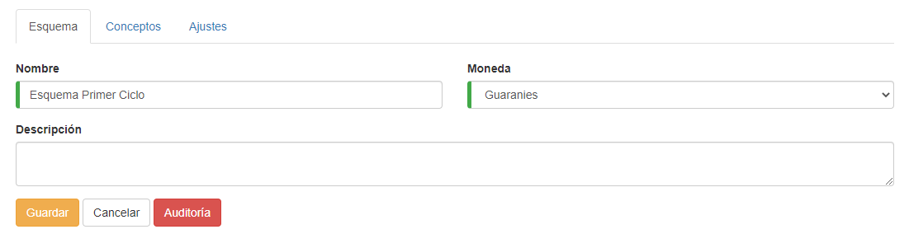

Si deseamos, podemos modificar los datos y presionar **Guardar**.

Si vamos a la pestaña **Conceptos**, veremos esta interfaz:

Para agregar conceptos, hacemos clic en **Agregar Concepto**. *Las instrucciones para esto se encuentran más adelante*

Podemos hacer clic en el icono de la **'X'** (en la columna **Eliminar**) para eliminar un concepto.
Si damos clic en el nombre de un concepto, podemos ver y modificar sus detalles, así como ver y modificar sus pagos:
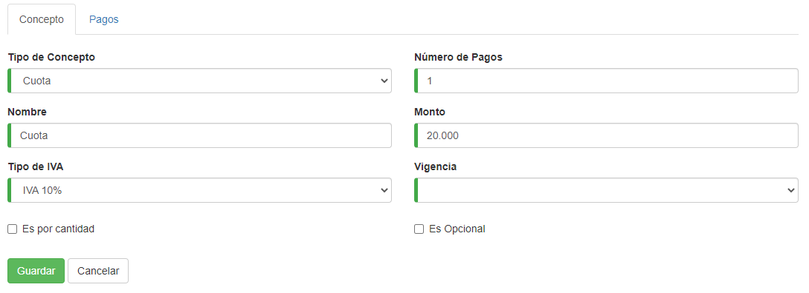

Volviendo a la visualización del precio esquema:

En la pestaña Ajustes, podemos ver los ajustes del precio esquema:

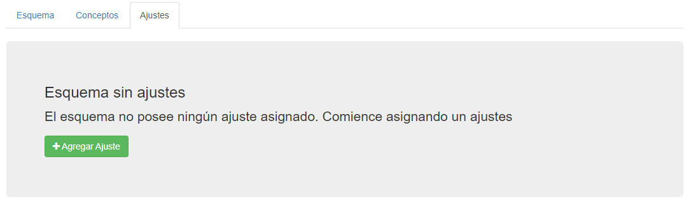

De aquí podemos agregar un ajuste haciendo clic en botón **Agregar Ajuste**.

Volviendo a la interfaz de precios:

Podemos editar las fechas (Desde y Hasta) y la categoría del precio. Para esto hacemos clic sobre sus campos correspondientes:

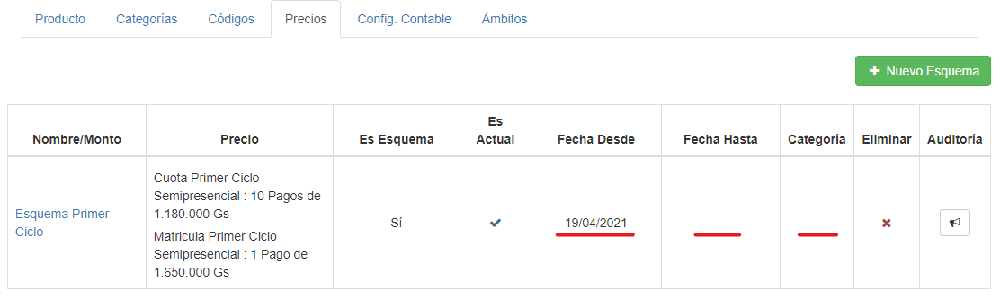
*También podemos marcar un precio como actual, haciendo clic en su icono de viñeta, en la columna **Es Actual** (exclusivo para cuando hay más de un precio y queremos cambiar de precio principal)*

Si queremos eliminar un registro, debemos hacer clic en el icono rojo en forma de **'X'**, de la columna **Eliminar**.

Para agregar un precio, debemos hacer clic en el botón **Nuevo Esquema**.

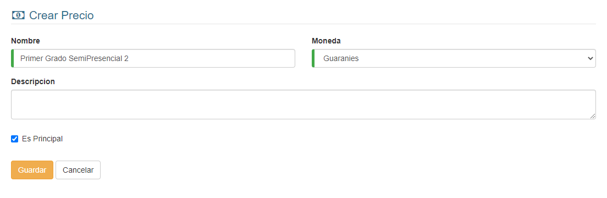

Después de ingresar los datos, hacemos clic en **Guardar**.

Luego agregamos los conceptos (si no queremos agregar conceptos, podemos hacer clic en **Cancelar**):

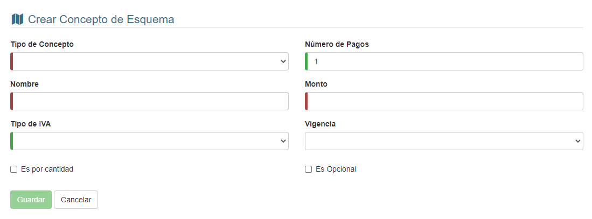

Después de ingresar los datos, hacemos clic en **Guardar**.

Si queremos agregar más conceptos, hacemos clic en **Agregar Concepto** y repetimos lo anterior:

