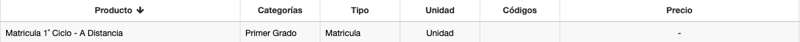
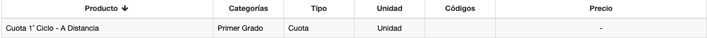

## Concepto para Esquema

### Cuota, Matrícula

El tipo de producto Cuota o Matrícula, permite definir un producto que puede ser utilizado como concepto de un esquema.
Ejemplo:

* Podemos crear primero un producto de nombre Cuota 1˚ Ciclo, del tipo Cuota.

  

* Podemos crear luego otro producto de nombre Matricula 1˚ Ciclo.

  

Estos productos, ya están habilitados para utilizar en esquemas. Como por ej en el caso del Esquema 1˚ Ciclo, donde utilizamos estos
conceptos.

A este tipo de productos se le puede asignar un precio unitario. Ya que puede venderse por separado, por ej. en una factura.

### Otros tipos de productos

Si un producto no es del tipo Cuota o Matrícula, entonces no se puede utilizar para configurar un esquema.