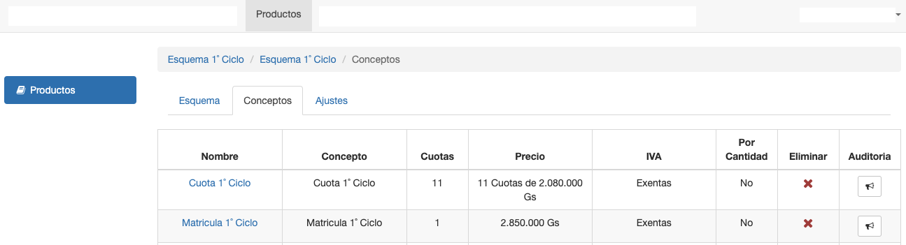
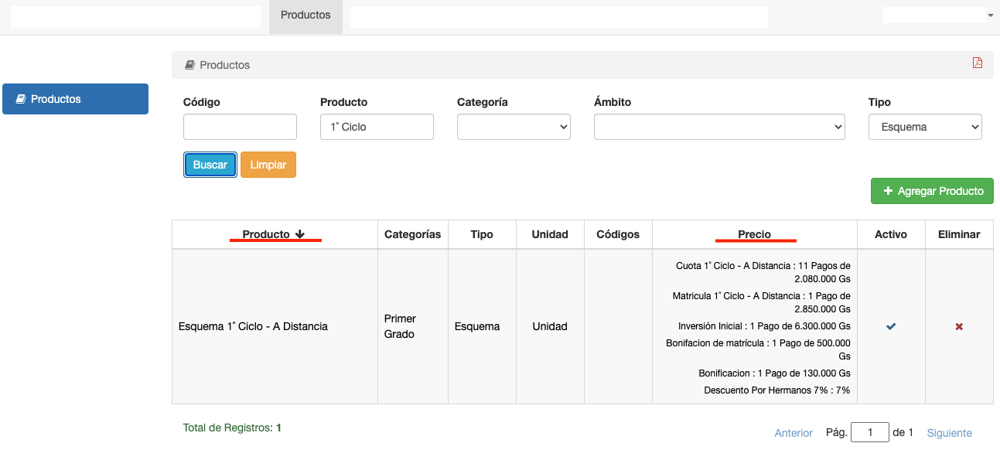
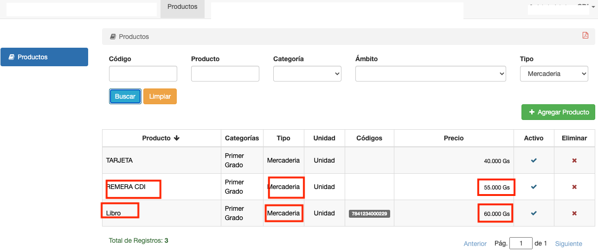

# Precio de Venta

## Precio Esquema

El tipo de producto Esquema, permite definir un producto que al venderse va a generar una deuda. La deuda se genera de
acuerdo al esquema de pagos que se configuró para el producto. El esquema de pagos puede configurarse con:

* Conceptos. Se pueden configurar varios conceptos como por ej: Cuota, Matrícula. Cada concepto define cantidad de
  pagos, monto de pago,fecha de cada vencimiento.

* Ajustes. Se pueden definir ajustes que se aplican a los conceptos. Como por ej:
  Recargo por vencimiento, o Descuentos.

Ejemplo: El producto Esquema 1˚ Ciclo, tiene un esquema donde se configuran los conceptos.

El precio de venta del producto, es el esquema:

Un producto de tipo Esquema. No se puede vender directamente en una factura. Se puede utilizar para generar una deuda.
Por ej. Al inscribir a un curso. Y esta deuda generada, si se puede facturar.

## Precio Unitario

Los otros Tipo de Producto, que no son Esquema, permiten definir un precio unitario para el producto. Con este precio
unitario, el producto se puede facturar directamente. Por ej un libro o remera puede tener un precio unitario:

