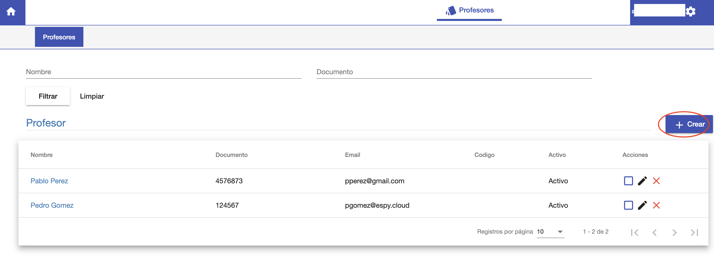
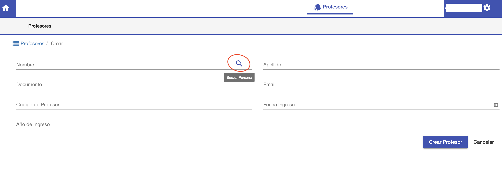
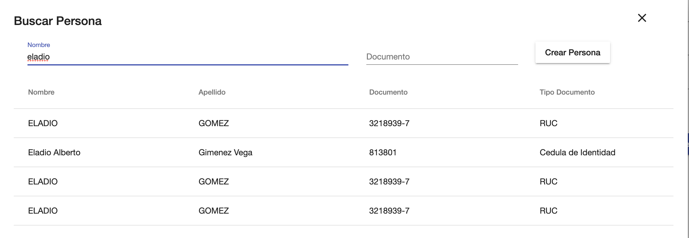
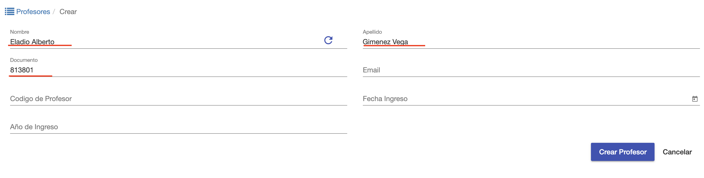
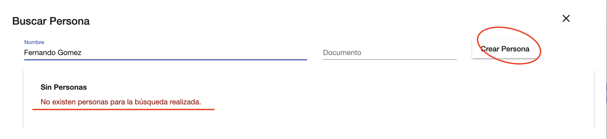
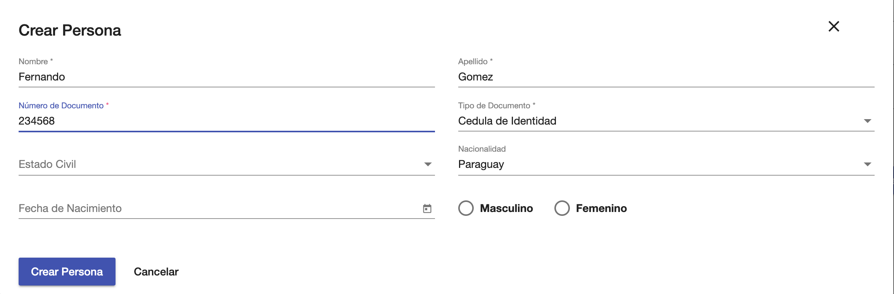
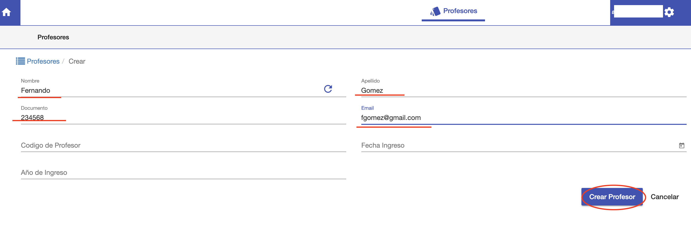
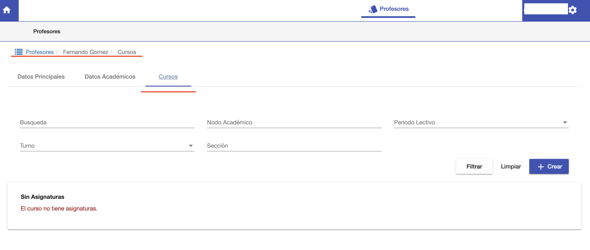

#Crear Profesor

Para crear un profesor, click en botón Crear Profesor del listado.

Se despliega una pantalla donde se puede:

1. Elegir una persona ya existente en sistema y registrarla cómo profesor.
2. Crear una persona nueva,no existente en sistema, y registrala como profesor.

## Elegir persona y crear profesor

Se puede crear un profesor, apartir de una persona ya existente en sistema y que todavía
no esté registrada cómo profesor.

Para elegir la persona, click en el botón buscar:

Se despliega un buscador de personas, donde se puede filtrar por:

1. Nombre
2. Documento

Al pulsar Enter en este buscador, el sistema realiza la busqueda y muestra
una grilla con los resultados encontrados. Que coincidan con el nombre y/o documento buscados.

Si se encuentra la persona, se puede elegir en la grilla. Y el
el sistema continua con la interfaz de crear profesor, ya con los datos
precargados de la persona elegida.

Luego se deben completar los datos faltantes y pulsar Crear Profesor.

* **Nombre** - Obligatorio
* **Apellido** - Obligatorio
* **Documento** - Obligatorio
* **Email** - Obligatorio
* Código de Profesor - Opcional
* Fecha Ingreso - Opcional
* Año de Ingreso - Opcional

## Crear persona y profesor

Si la persona que se busca, no existe en 
sistema. Entonces se puede pulsar Crear Persona.

Se completan los datos de la persona y se crea la Persona.

Luego el sistema lleva a la interfaz para continuar creando el profesor, ya con
la persona recién registrada. 
Donde se completan de igual manera los demás
campos necesarios para el profesor, para luego pulsar Crear Profesor.

## Profesor ya creado
Luego de pulsar Crear Profesor, el sistema muestra un breve mensaje de color
verde, confirmando la creación exitosa del profesor. Y lleva al usuario a la interfaz de edición
del profesor, para continuar con la asignación de sus cursos.

