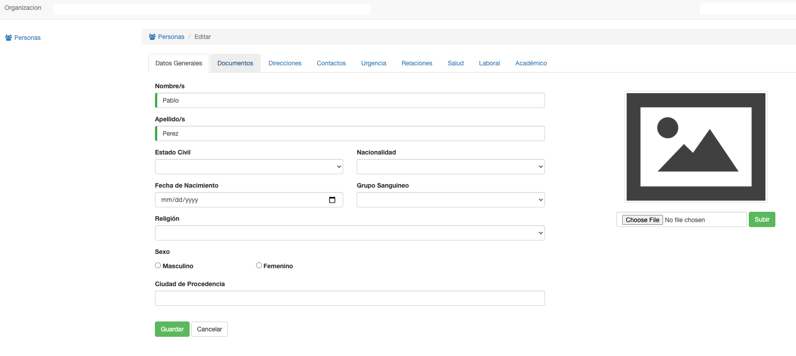

#Editar Datos Personales

En el listado, al hacer click en el nombre de un profesor. El sistema lleva al usuario a la interfaz, en Voyager, para
editar los datos correspondientes a la Persona, asociada al profesor.

Aquí se pueden editar y asignar:

1. Datos Generales
2. Documentos de la persona.
3. Direcciones de la persona.
4. Contactos, cómo email y teléfonos.
5. Subir la foto.
6. Entre otros.

