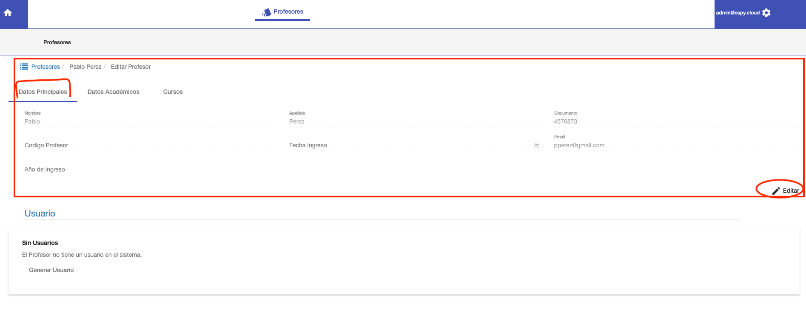
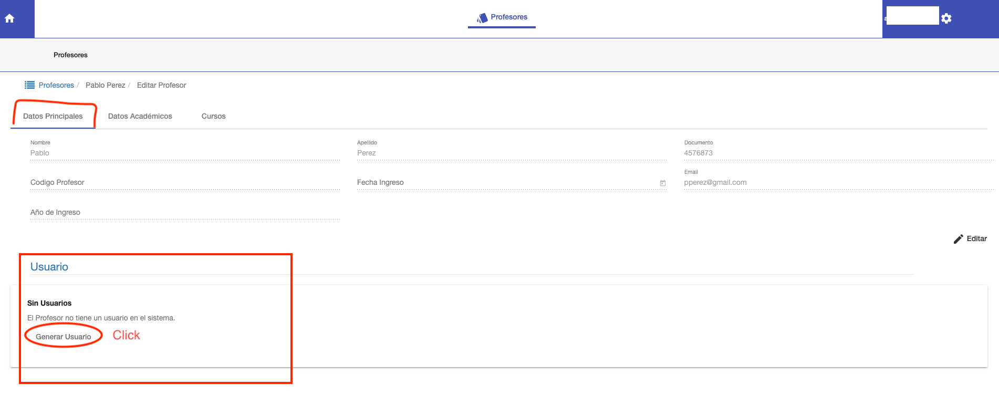
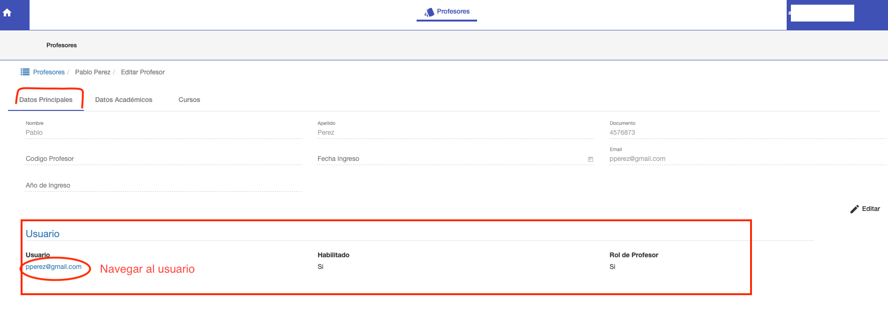

#Editar Datos Principales

En la pestaña Datos Principales del profesor, se puede:

1. Modificar los datos del profesor.
2. Generar Usuario para el profesor.

##Modificar los datos del profesor
En esta sección se pueden visualizar y modificar los datos del profesor como:

* Código de Profesor
* Fecha de Ingreso
* Año de Ingreso
* Email. El email se utiliza para generar Usuario para acceso al sistema.

Para editar, click en el botón Editar para habilitar estos campos. Luego se puede Guardar o Cancelar la edición.

##Generar Usuario para el profesor
En esta sección se puede generar un Usuario para que el profesor acceda al sistema.
Con este usuario de acceso, el profesor puede acceder al sistema y gestionar sus cursos.

Para generar el usuario, se hace click en **Generar Usuario**.

Con esta acción se crea un usuario con las siguientes
credenciales de acceso:

* Email del Profesor, como email de acceso.
* Nro de Cedula, como Password.

Luego de generarse se muestra que el profesor, ya tiene Usuario. Y puede navegarse hasta el usuario
del profesor, en Voyager, para administrar si requiere más permisos o deshabilitar.

