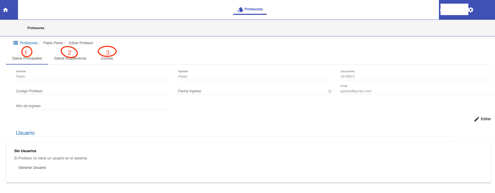

#Editar Profesor

@@toc { depth=1 }
@@@ index
* [Editar Datos Principales](editar_datos_principales.md)
* [Editar Cursos](editar_cursos.md)
@@@

En el listado, al hacer click en el ícono de editar un profesor. El sistema lleva a la interfaz, para editar datos
académicos del profesor. Aquí se muestran tres pestañas:

1. Datos Principales. Editar los datos del profesor y generar usuario.
2. Datos Académicos. Asignar la/s unidad académica a la que corresponde el profesor. Opcional.
3. Cursos. Asignar los cursos correspondientes al profesor.

