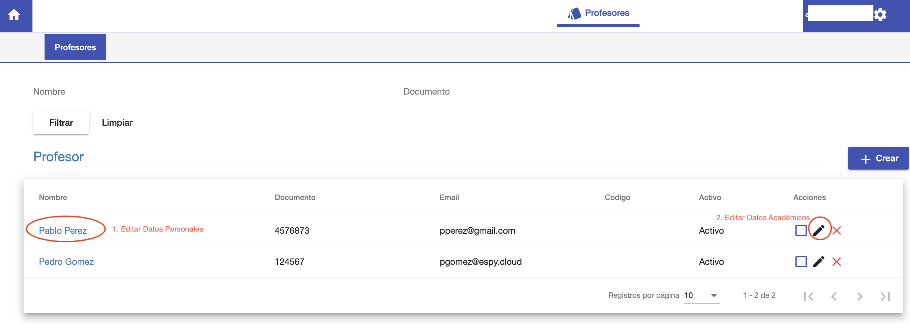

#Editar Profesor

@@toc { depth=1 }
@@@ index
* [Editar Datos Personales](editar_datos_personales.md)
* [Editar Profesor](editar_profesor.md)
@@@

Para editar un profesor, se busca al profesor en el listado. Y al encontrarlo se puede:

1. Editar sus datos personales
2. Editar sus datos académicos

