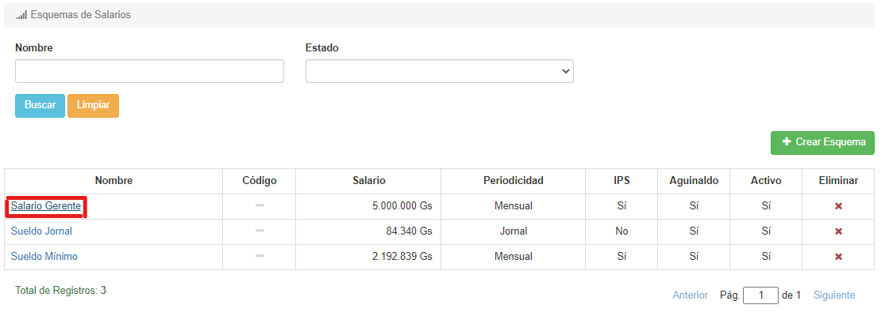
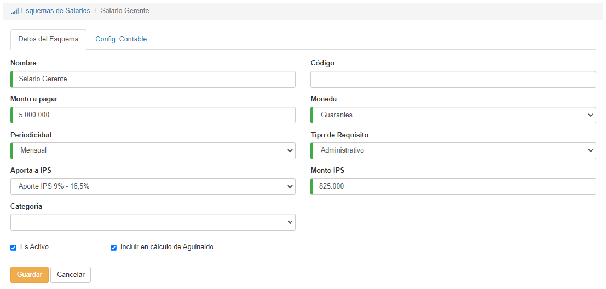
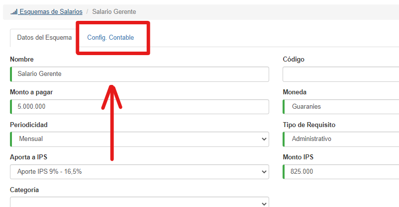
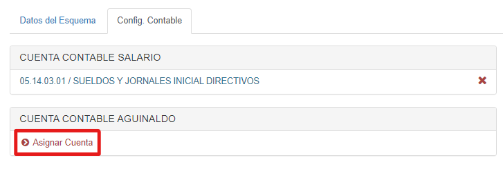
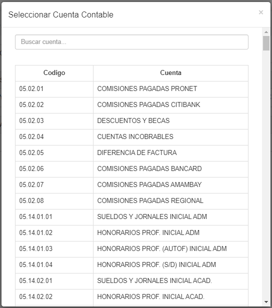
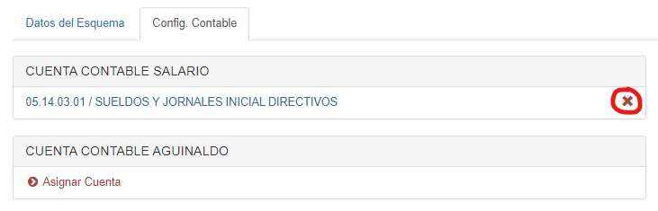

# Editar Esquemas

Desde la lista, podemos modificar un registro haciendo clic sobre su nombre:

El sistema mostrará esta interfaz:

Si queremos, podemos modificar los datos y hacer clic en **Guardar**; si no queremos modificar los datos, hacemos clic en **Cancelar**.

## Configuración Contable

En la parte superior veremos unas pestañas, de donde podemos ver la configuración contable del esquema:

La interfaz se ve así:

Para agregar una cuenta, debemos hacer clic en el botón **Asignar Cuenta**, en la sección deseada:

Luego buscamos la cuenta deseada y hacemos clic sobre ella:

*Solo puede haber **una** cuenta en cada categoría.*

Si queremos eliminar una cuenta, podemos hacer clic en el icono de **'X'**:

*No se puede eliminar una categoría de un esquema si existen funcionarios con dicho esquema asignado.*
