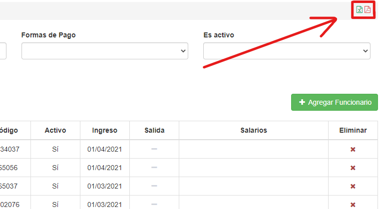

# Generar reporte de Funcionarios

Se pueden generar reportes de los registros. Para esto nos dirigimos a la esquina superior derecha:

Haciendo clic en estos iconos, podemos hacer reportes en formato Excel o en PDF. El Excel se descarga automáticamente, el PDF se abre en una pestaña nueva, de donde se permite la descarga o impresión (entre otros).

También podemos filtrar los funcionarios, para que se reporten solamente los registros filtrados.