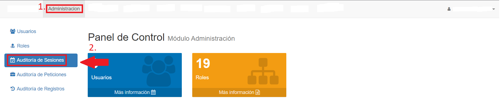
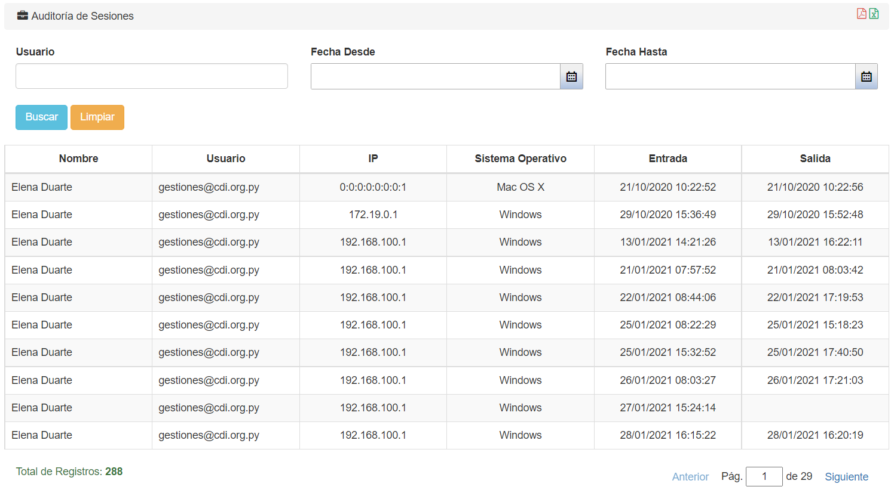
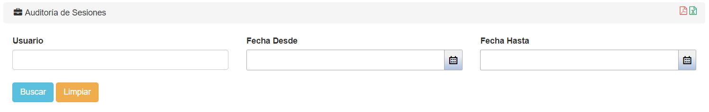
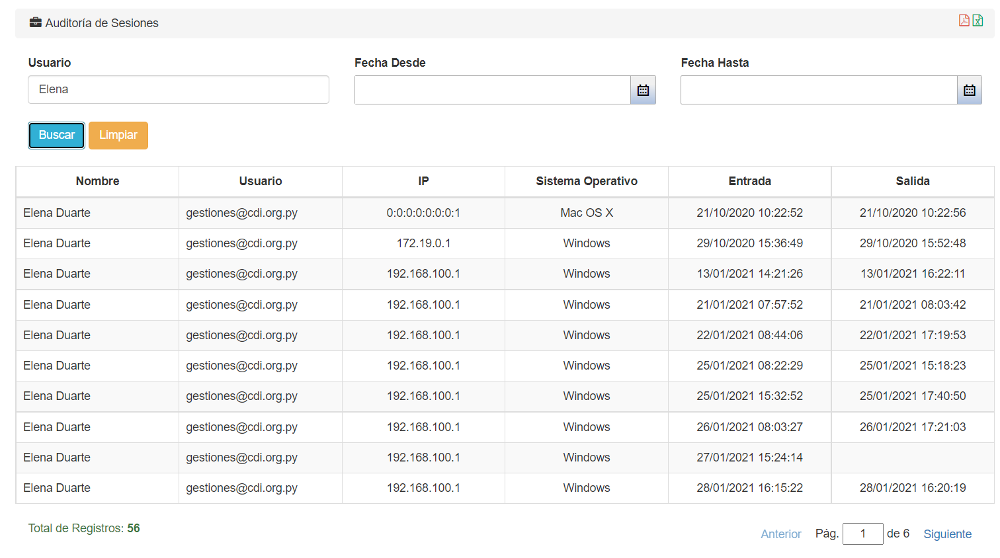

# Auditoría de sesiones

Le permite al usuario listar todas las sesiones realizadas en el sistema, pudiendo así visualizar el usuario que ingresó, desde que IP, sistema operativo y la fecha y hora de entrada y salida al sistema.

Para acceder a la funcionalidad de auditoría de sesiones, hacemos click en la pestaña **Administración** y luego seleccionamos la opción *Auditoría de Sesiones* en el índice izquierdo:

El sistema nos listará las auditorías de sesiones:

Hay un máximo de diez registros en cada página.

Abajo de la lista se pueden ver la cantidad total de registros y la página actual.
Se puede cambiar de página haciendo click en *Anterior*, en *Siguiente*, o escribiendo manualmente el número de página.

## Filtrar auditorías de sesiones

En la parte de arriba, se pueden filtrar los resultados de acuerdo a Usuario y un rango de fecha, desde la fecha y hasta la fecha:

*Ejemplo:*

Una vez se ingresan los datos a filtrar, presionamos el botón **Buscar** para que se filtren los resultados. Si queremos borrar los filtros, presionamos el botón **Limpiar**.