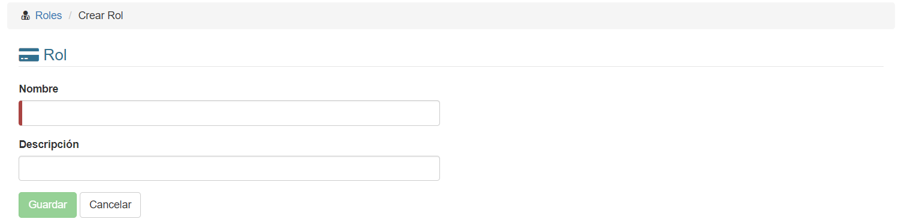

# Crear Roles
Para crear un rol, hacemos click en el botón **Nuevo Rol**:

*Al presionar el botón:*

Una vez aquí, debemos rellenar al menos los datos requeridos (los que tienen una línea roja al inicio). Al terminar, hacemos click en **Guardar**.

Al finalizar, hacemos click en **Guardar**.

El rol será creado.