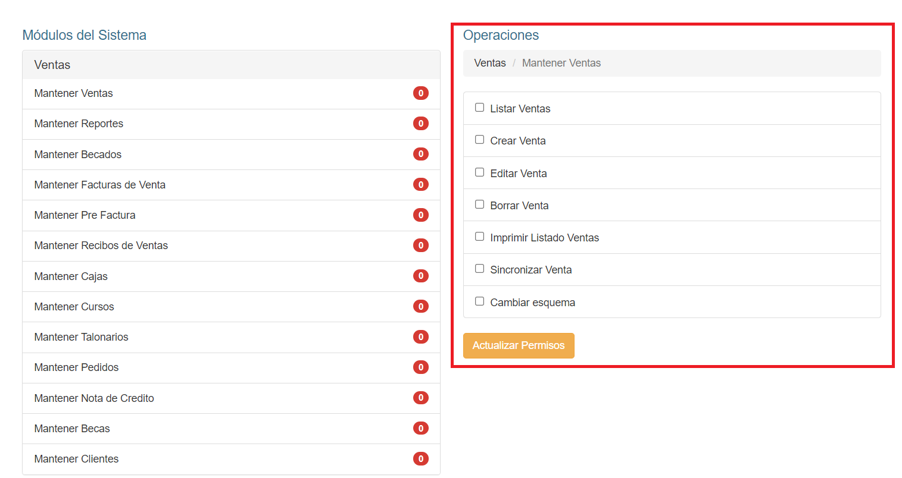

# Editar Roles

Una vez estamos en la lista, podemos modificar un registro haciendo click sobre su nombre:

El sistema mostrará esta interfaz:

De aquí podemos modificar los datos y hacer click en **Guardar**.

## Actualizar Permisos

En la parte inferior, veremos unas pestañas desplegables, donde cada pestaña son módulos del sistema:

Al hacer click sobre el módulo, se listarán las funcionalidades disponibles de ese módulo:

Al hacer click en una funcionalidad del módulo, podrá observar las operaciones que puede realizar con dicha funcionalidad en la sección derecha de la pantalla:

Para actualizar los permisos debe seleccionar las operaciones en la funcionalidad:

Una vez realizada la selección, debe hacer click en el botón **Actualizar Permisos** para guardar los cambios.

