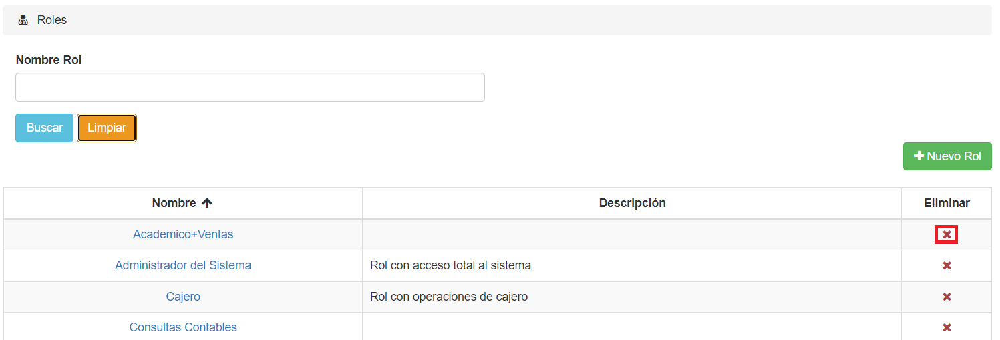

# Eliminar Roles

Para borrar un rol, debemos hacer click en el botón **'X'** del registro que deseamos eliminar. El icono se encuentra bajo la columna **Eliminar**:

El sistema nos pedirá confirmación: Al hacer click en **Aceptar**, el rol será borrado.