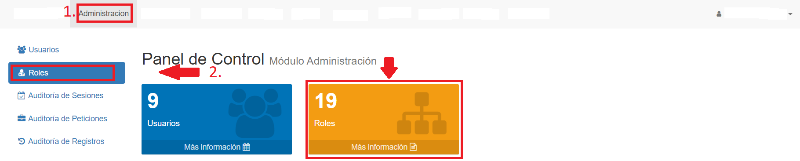
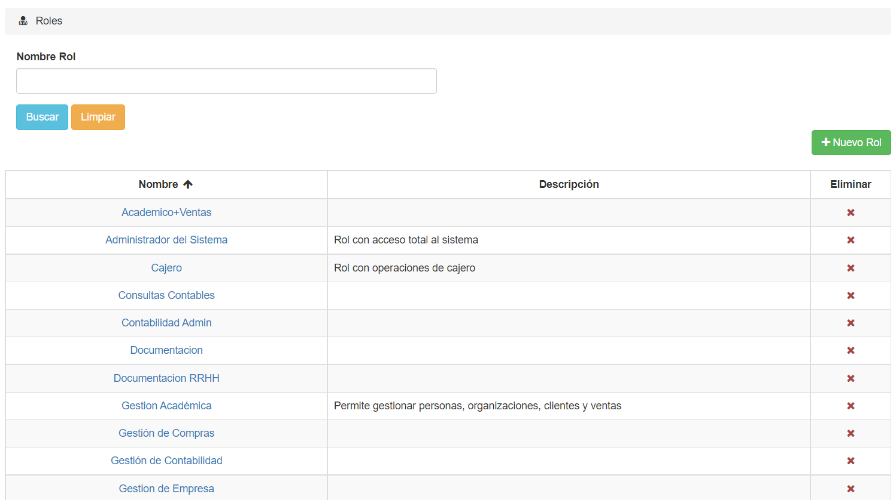
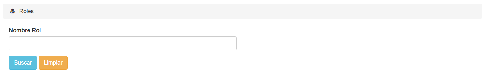
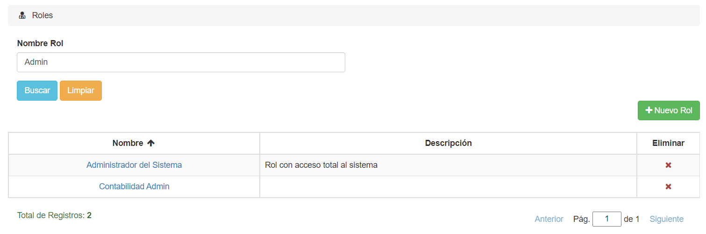

# Listar Roles
Para listar los roles, hacemos click en la pestaña **Administración** y luego seleccionamos la opción *Roles*, ya sea en el índice izquierdo o en el recuadro central:

El sistema nos listará los roles:

Hay un máximo de diez roles en cada página.

Abajo de la lista se pueden ver la cantidad total de registros y la página actual.
Se puede cambiar de página haciendo click en *Anterior*, en *Siguiente*, o escribiendo manualmente el número de página.

## Filtrar Roles

En la parte de arriba, se pueden filtrar los resultados de acuerdo al nombre del rol:

*Ejemplo:*

Una vez se ingresan los datos a filtrar, presionamos el botón **Buscar** para que se filtren los resultados. Si queremos borrar los filtros, presionamos el botón **Limpiar**.