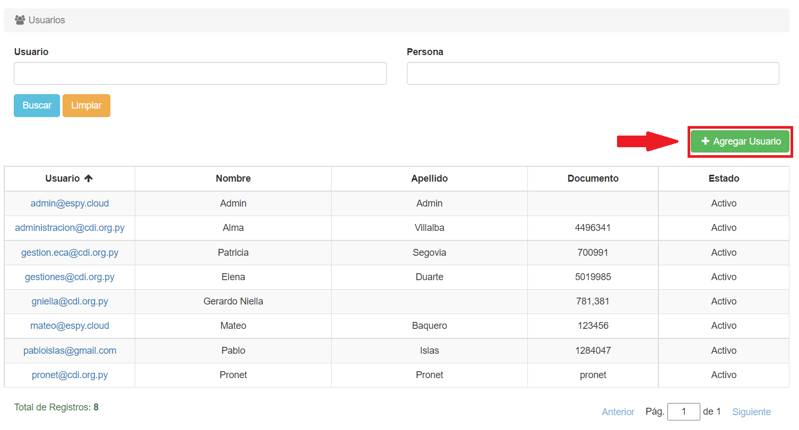

# Crear Usuarios
Para crear un usuario, hacemos click en el botón **Agregar Usuario**:

*Al presionar el botón:*

Una vez aquí, escribiremos el nombre o número de documento de la persona y se visualizará una lista desplegable con los resultados relacionados:

Si la persona que queremos agregar como usuario ya está registrada, podemos filtrarla (si es necesario) y luego hacer click sobre ella.

Si la persona no está registrada en el sistema, podemos crearla haciendo click en **Agregar nuevo**:

Debemos rellenar al menos los datos requeridos (los que tienen una línea roja al inicio). Al terminar, hacemos click en **Guardar**.

Cuando hayamos seleccionado a la persona, debemos ingresar (como mínimo) los campos requeridos:

Al finalizar, hacemos click en **Guardar**.

El usuario será creado.