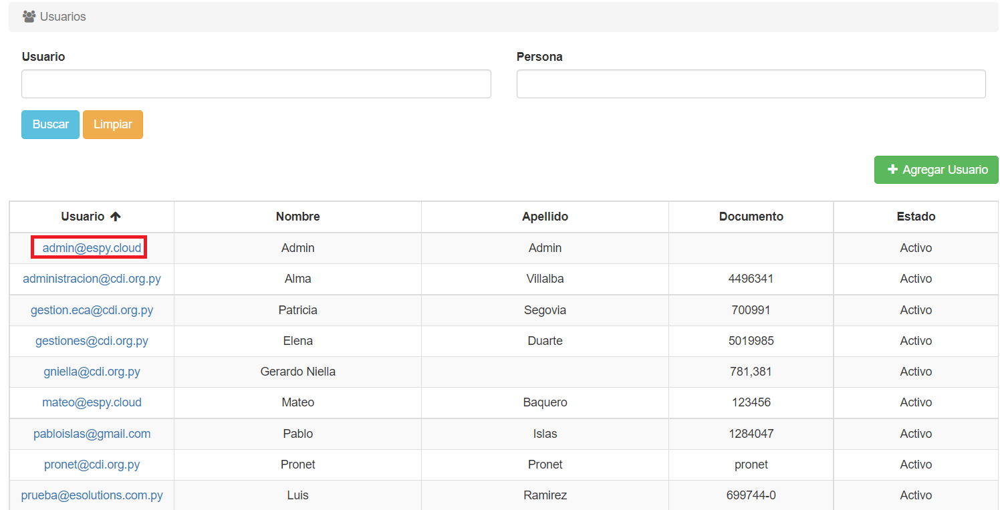
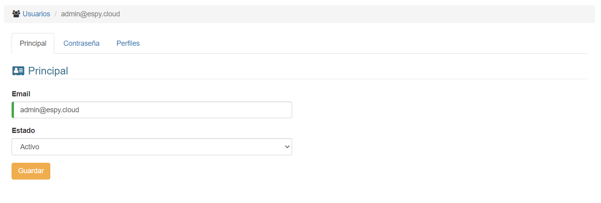
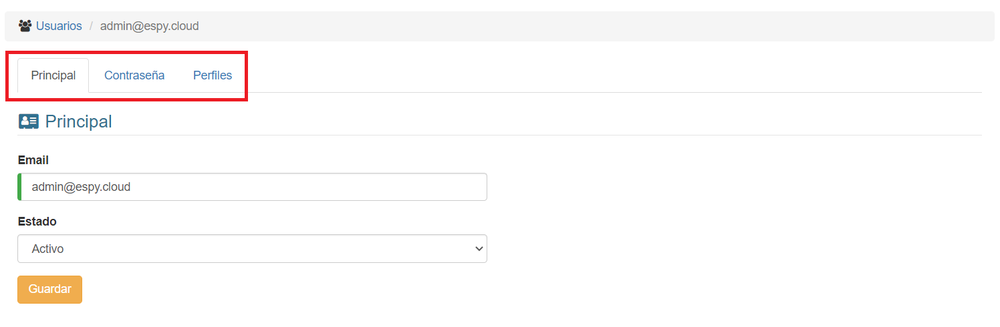

# Editar Usuarios

@@toc { depth=2 }
@@@ index
* [Contraseña](editar_usuarios_contrasenha.md)
* [Perfiles](editar_usuarios_perfiles.md)
@@@

Una vez estamos en la lista, podemos modificar un registro haciendo click sobre su nombre:

El sistema mostrará esta interfaz:

De aquí podemos modificar los datos y hacer click en **Guardar**.

En la parte superior, veremos unas pestañas, donde hay más información sobre el usuario:

