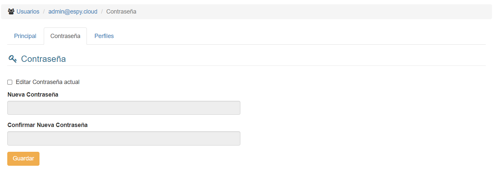
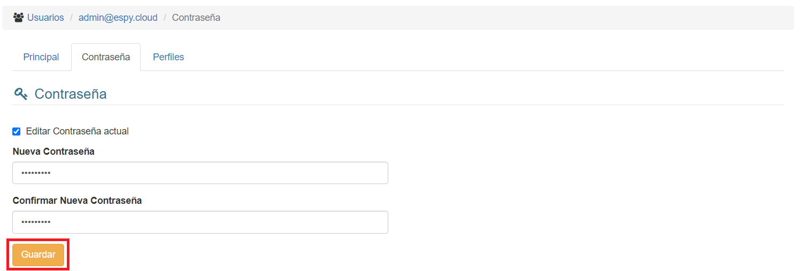

# Contraseña

Si hacemos click en la pestaña **Contraseña**, veremos esta interfaz:

Para habilitar la edición de la contraseña, haremos click en la casilla "Editar Contraseña Actual"

Completamos los campos con la nueva contraseña y hacemos click en el botón "Guardar".

