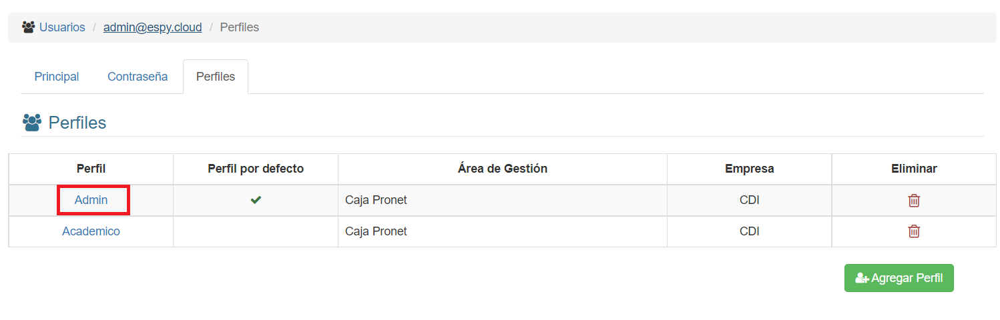

# Perfiles

@@toc { depth=1 }
@@@ index
* [Roles de Perfil](perfiles/perfil-roles.md)
* [Autorizaciones de Perfil](perfiles/perfil-autorizaciones.md)
@@@

Los perfiles permiten que el usuario tenga varios roles y autorizaciones acorde a la necesidad del usuario, permitíendole realizar cambios de perfiles según las operaciones que realizará en el sistema.

Si hacemos click en la pestaña **Perfiles**, veremos esta interfaz:

Podemos ver un perfil específico si hacemos click sobre su nombre:

Visualizaremos el perfil seleccionado:

Podemos modificar el perfil al presionar **Editar**.

Desde aquí podemos modificar el perfil y presionar **Guardar**.
Para volver presionamos **Cancelar**.

Podemos agregar un perfil al usuario, haciendo click en **Agregar Perfil**:

Debemos rellenar al menos los datos requeridos (los que tienen una línea roja al inicio). Al terminar, hacemos click en **Guardar**.

Si queremos borrar un perfil, debemos hacer click en el icono de **'basurero'** correspondiente:

Luego debemos confirmar o cancelar la acción de borrado haciendo click en la ventana de diálogo emergente.

## Cambios de Perfil

Un usuario puede tener varios perfiles asignados y este puede cambiar del perfil en el sistema. Por ejemplo: Un usuario dado puede tener el perfil
de *CAJERO* para realizar las operaciones sobre caja, pero así también puede tener un perfil de *AUXILIAR CONTABLE*, entonces si
el usuario estará efectuando operaciones sobre alguna caja, deberá utilizar el perfil de *CAJERO* en caso de querer obtener datos contables,
deberá cambiarse de perfil a *AUXILIAR CONTABLE*.

Para realizar el cambio de perfil un usuario debe hacer click en su nombre de usuario ubicado en la esquina superior derecha de la pantalla:

Seguidamente, se desplegará la siguiente interfaz donde se podrá visualizar los perfiles que cuenta el usuario:

El perfil activo, se visualiza con el ícono de check seleccionado. Si deseamos cambiar de perfil, hacemos click en el perfil deseado y se visualizará el sistema según el perfil seleccionado.