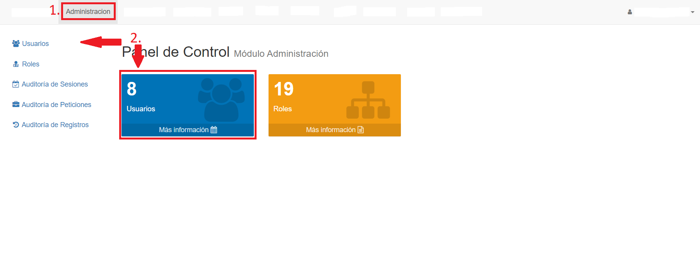

# Usuarios
@@toc { depth=1 }
@@@ index
* [Listar Usuarios](listar_usuarios.md)
* [Crear Usuarios](crear_usuarios.md)
* [Editar Usuarios](editar_usuarios.md)
@@@

Para acceder a la funcionalidad de usuarios, hacemos click en la pestaña **Administración** y luego seleccionamos la opción *Usuarios*, ya sea en el índice izquierdo o en el recuadro central:

