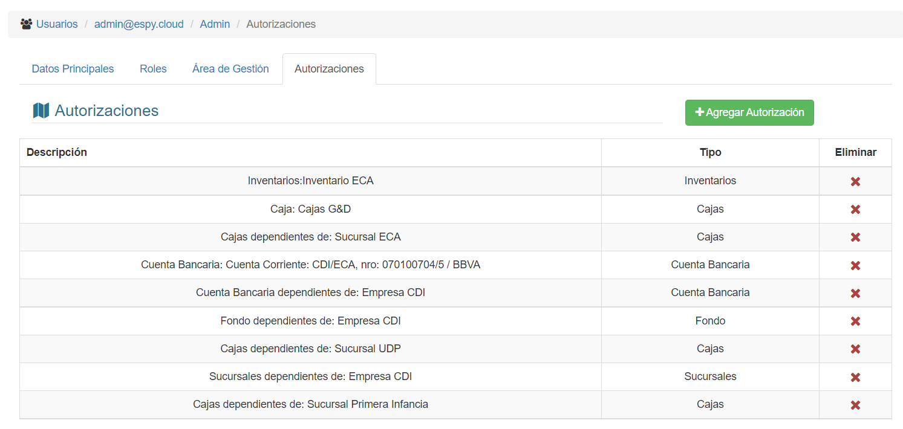
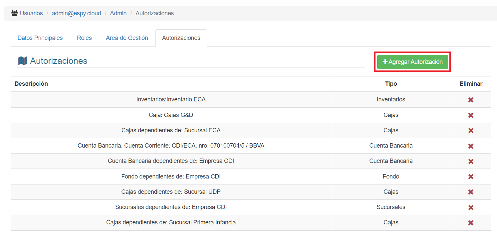
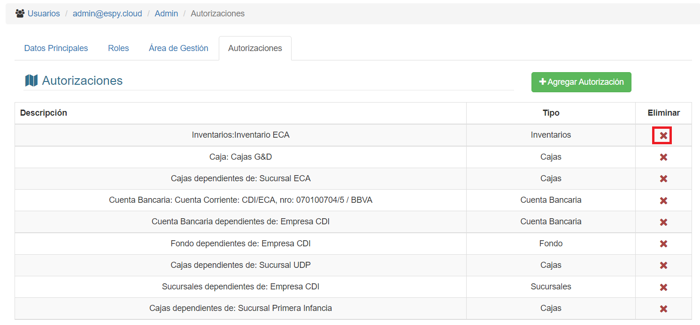

# Autorizaciones de Perfil

Las autorizaciones son permisos a operar sobre los distintos recursos disponibles definidos según los tipos de autorización disponibles.

## Los tipos de autorización

Los tipos de autorización pueden ser:

* **Cajas** : autoriza al perfil a realizar operaciones en las cajas registradas en el sistema.
* **Sucursales** : autoriza al perfil a realizar operaciones acerca de las sucursales registradas en el sistema.
* **Inventarios** : autoriza al perfil a realizar operaciones en los inventarios registrados en el sistema.
* **Cuentas bancarias** : autoriza al perfil a realizar operaciones en las cuentas bancarias registradas en el sistema.
* **Fondos** : autoriza al perfil a realizar las operaciones en los fondos registrados en el sistema.

Si hacemos click en la pestaña **Autorizaciones**, veremos esta interfaz:

## Agregar Autorización

Para agregar una nueva autorización, debemos hacer click en el botón **Agregar Autorización**

Seguidamente, se abrira una ventana emergente donde deberá seleccionar el tipo de autorización y el ítem a ser autorizado:

Una vez que haya seleccionado, puede hacer click en el botón **Guardar** para asignar la autorización; en caso de no querer realizar la operación haga click en el botón **Cancelar**

## Borrar Autorización

Para borrar una autorización, debemos hacer click en el botón **'X'** del registro que deseamos eliminar. El icono se encuentra bajo la columna **Eliminar**:

El sistema nos pedirá confirmación: Al hacer click en **Aceptar**, la autorización será borrada del perfil.
