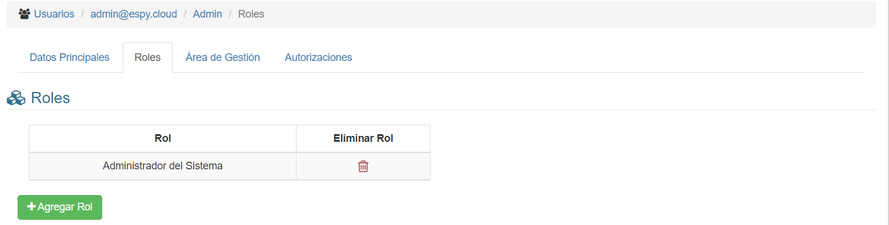
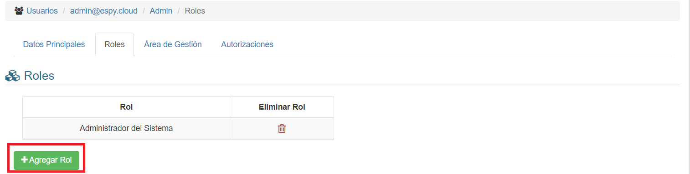
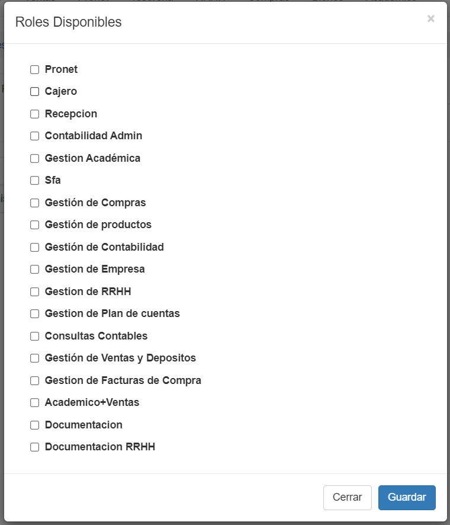
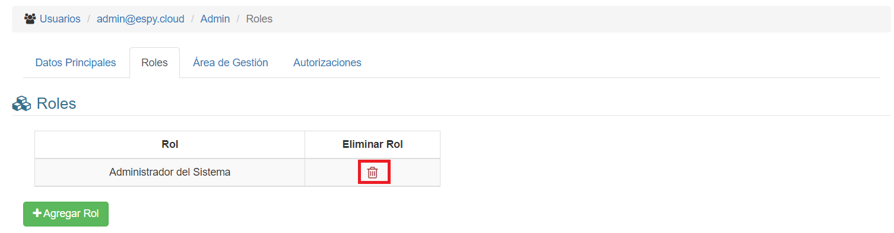

# Roles de Perfil
Si hacemos click en la pestaña **Roles**, veremos esta interfaz:

## Agregar Rol

Para agregar un nuevo rol, debemos hacer click en el botón **Agregar Rol**

Seguidamente, se abrira una ventana emergente donde deberá seleccionar los roles a asociar:

Una vez que haya seleccionado, puede hacer click en el botón **Guardar** para asignar los roles; en caso de no querer realizar la operación haga click en el botón **Cerrar**

## Borrar Rol

Para borrar un rol, debemos hacer click en el icono de **Papelera** del registro que deseamos eliminar. El icono se encuentra bajo la columna **Eliminar Rol**:

El sistema nos pedirá confirmación: Al hacer click en **Aceptar**, el rol será borrado del perfil.
