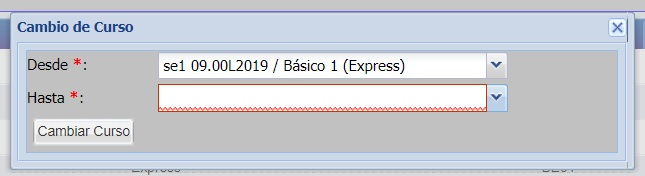
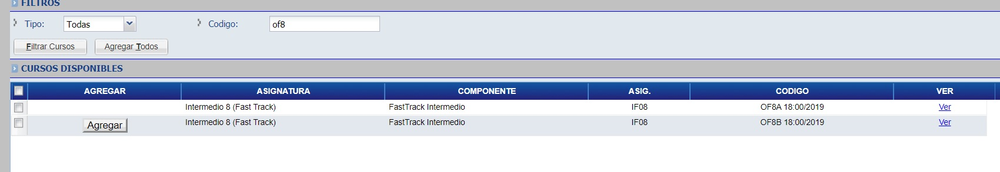

# Cursos

## Buscar curso por codigo de curso
En el apartado de Filtros, complete los campos y finalmente haga click en el botón "Filtrar Cursos", de tal manera que la lista de _"Cursos Disponibles"_ le traerá los resultados que coincidan con el filtro aplicado.

## Agregar curso
Seleccione el curso y haga click en el botón "Agregar"

Haga click en el botón "Guardar" para sincronizar el sistema académico con el sistema administrativo.

## Dar de Baja a Alumno

Para ver como dar de baja a un Alumno de un curso, haga click @ref:[aqui](./manejarPendientes.md) 

## Estado de Cursos
Los cursos pueden tener los siguientes estados:

* Pendiente (P): Inscripción con algún problema académico, pendiente de confirmación académica.
Las inscripciones en estado se pueden borrar pasando directamente la inscripción al estado “A” y guardando los cambios.
* En Proceso (R): Inscripción realizada en el sistema académico, aun no genero deudas en el administrativo. Cuando se guarde el sistema intentará generar deudas en el sistema administrativo, de conseguirlo la inscripción cambiará a uno de los estados siguientes posibles, dependiente de las circunstancias: “C, L, V”
Las inscripciones en estado se pueden borrar pasando directamente la inscripción al estado “A” y guardando los cambios.
* Sincronizado (C): Inscripción realizada en sistema académico y administrativo.
* Borrado (B): Inscripción que se quiere dar de baja, en el caso de realizarse correctamente la inscripción pasará a estado D - Desinscripto.
* Migrado (M): Inscripción migrada de otra fuente o sistema.
* Finalizado (F): Inscripción realizada en sistema académico y administrativo; el alumno ya abonó todas las deudas por este curso.
* Desinscripto (D): El alumno se dio de baja desde el sistema académico.
* Anul./Rech. (A): Inscripción anulada.
* Al Dia (L): Inscripción realizada en sistema académico y adminsitrativo, aún no pago todas las deudas por este curso , pero ya tiene pagadas las deudas que han vencido.
* Vencido (V): Inscripción realizada en sistema académico y adminsitrativo, aún no pago todas las deudas por este curso , y tiene deudas pendientes de pago que han vencido.

## Facturacion
Haga click en el botón _"Facturación"_

_Observación: esta acción lo dirigirá al sistema administrativo_

Una vez en el sistema administrativo, podrá visualizar la pre-factura.

## Cambio de Seccion

El cambio de sección permite cambiar a un alumno de un curso a otro, pasando sus deudas del curso de origen al curso de destino.
Para utilizar esta funcionalidad el alumno debe estar inscripto en los dos cursos (en el de origen, y se debe agregar la inscripción al curso al que quiere ir de forma normal (“Agregar Curso”).
Estando el alumno inscripto en ambos cursos (teniendo dos grupos de deuda, uno por cada curso), se debe presionar el botón “Cambio de Sección” , lo cual muestra una ventana similar a la siguiente:

Aquí se debe elegir el curso de origen y el curso de destino y presionar el botón "Cambiar Curso", seguidamente se abrira el sistema administrativo de tal manera que confirme así sus deudas del de origen al de destino segun definido en el sistema, quedando las deudas saldadas/pendientes en el curso destino, y dandose de baja en el curso original. 

## Preguntas Frecuentes

**Pregunta:** _¿ No aparece el curso al cual quiero inscribir al alumno?_

  * **Respuesta:** Consultar con su coordinador si el curso fue creado, o verificar si el mismo existe utilizando el @ref:[Buscador de Cursos](../cursos/index.md#buscador-de-curso) 

**Pregunta:** _El curso esta creado, pero no aparece para agregar._

  * **Respuesta:** Verificar la fecha de finalización del mismo, los cursos aparecen para agregarse hasta 45 días despues de haber finalizado según la fecha definida en los @ref:[Datos del Curso](../cursos/cursosVer/datosPrincipales.md#datos-principales).

**Pregunta:** _El curso aparece, pero no tiene botón de Agregar_

  
  
  * **Respuesta:** El alumno ya esta inscripto a dicho curso, ir hacia abajo en la pagina en la tabla de “Cursos Inscriptos” y verificar que el mismo ya no se encuentre ahi.

**Pregunta:** _Al guardar el curso, recibo un mensaje de error que dice que no tiene esquema asignados._

  * **Respuesta:** Informe a su coordinador para que agregue el esquema (precios) correspondiente al curso.

**Pregunta:** _Solo me aparecen cursos de un año anterior, que hacer_

  * **Respuesta:** Verifque en la parte superior izquierda de la pagina que la inscripción que esta realizando corresponde al periodo (año) actual en el campo que dice “Periodo Lec.:“, en caso de que mencione un año distinto al actual, utilice el buscador de inscripciones (enlace al buscador de inscripciones de alumno) y elija la inscripción al año correspondiente; o cree una nueva inscripción en ese periodo/carrera en caso de no existir uno (enlace a crear inscripción)

