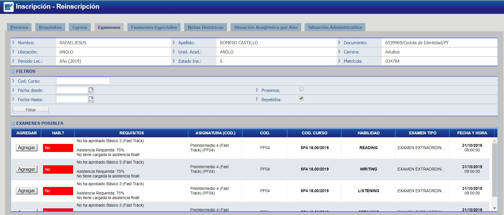
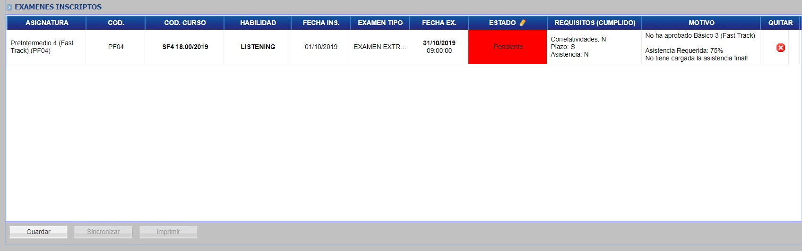

# Examenes Extraordinarios

En la pestaña de examenes usted podrá inscribir al alumno a un examen.  Puede filtrar la lista de Examenes Posibles utilizando el filtro.
Una vez identificado el examen a ser inscripto, haga click en el botón "Agregar".

Una vez agregado, se mostrará una lista de exámenes inscriptos y haga click en "Guardar" para confirmar la transacción.

