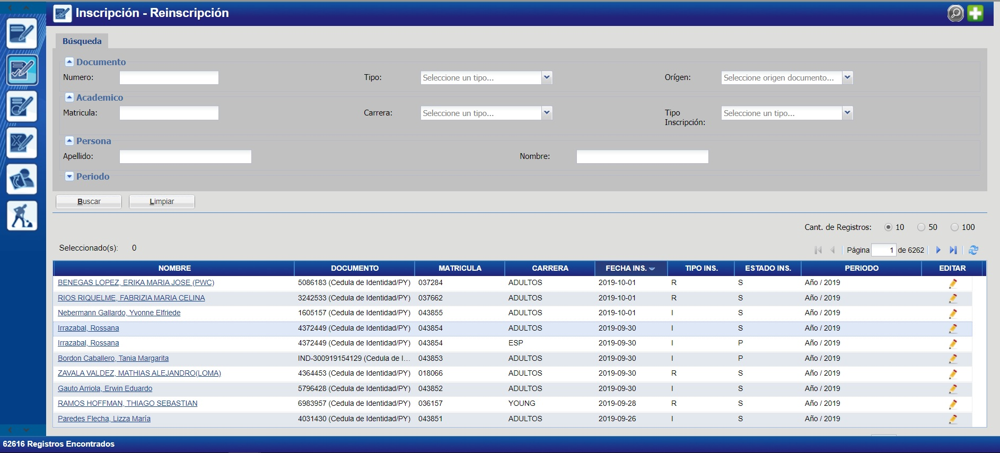

# Inscripciones

## Listar inscripciones

Para visualizar todas las inscripciónes del sistema, debe acceder al módulo _"Ins. Carrera"_, en la funcionalidad _"Mantener Inscripciones"_

En el cuadro superior, en la sección de _"Búsqueda"_ usted podrá completar campos como: Documento, Matrícula, Apellido, Nombre, etc. Para filtrar las inscripciones, debe hacer click en el botón _"Buscar"_.

_Observación: El botón "Limpiar" se puede utilizar para vaciar los campos que fueron completados en la sección de "Búsqueda"_

